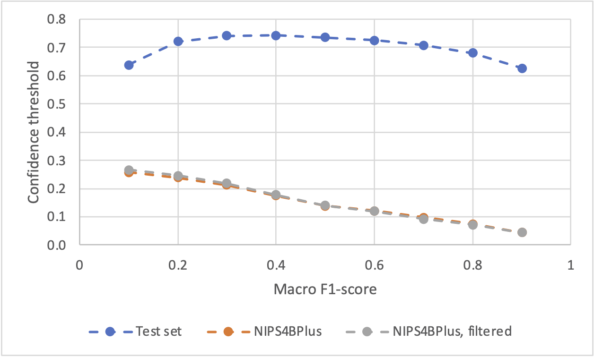
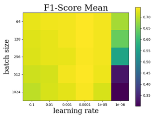
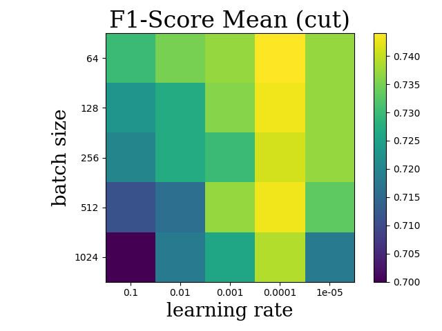
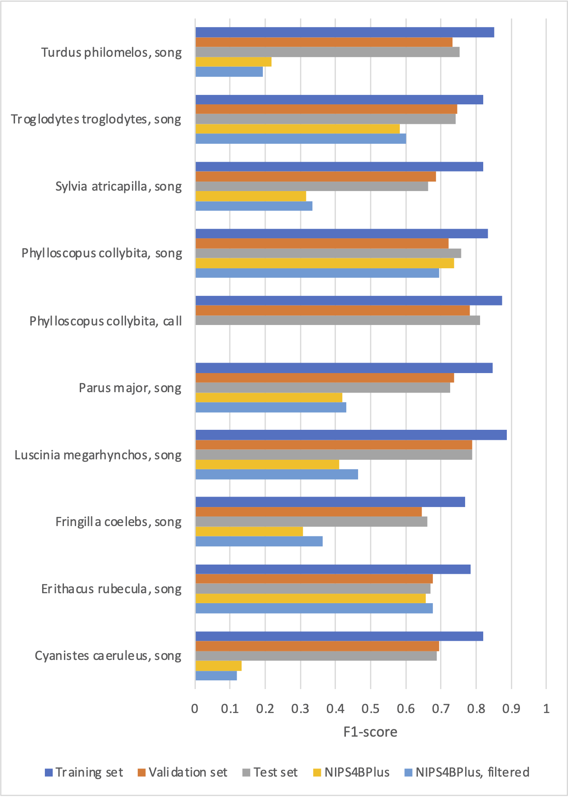

# Blackbird or Robin? - Implementation of a Fully Automated Machine Learning Pipeline for Bird Sound Recognition

#### Josafat-Mattias Burmeister, Maximilian Götz

## Contact

josafat-mattias.burmeister@student.hpi.de

maximilian.goetz@student.hpi.de

## Abstract

<div align="justify">
Audio recorders that capture bird sounds are increasingly used in conservation biology to monitor bird
populations. However, labeling the collected audio data requires trained ornithologists and is a very time-consuming task. To facilitate training of deep learning models that automate the labeling process, this work implements an end-to-end machine learning pipeline for the automated recognition of bird sound in audio recordings. The presented pipeline can be run both as a Jupyter notebook and as a Kubeflow pipeline. The pipeline includes steps for collecting and downloading suitable training data, preprocessing and filtering the training data, and for training, tuning, and evaluating deep learning models. As this approach has been very successful in previous work, the pipeline is focused on training image classification models on spectrogram images. The pipeline is evaluated using an example dataset with ten different bird sound classes from the Xeno-Canto database. A macro F<sub>1</sub>-score of 72.6% is achieved on this dataset, with F<sub>1</sub>-scores for all classes above 66%.
</div>

## 1 Motivation

<div align="justify">

Estimates of bird populations are an essential element in conservation biology for determining the conservation status of bird species and for planning conservation measures [[21](#monitoring-overview), [18](#audio-monitoring)]. Therefore, monitoring programs exist for many bird species in which the abundance of the target species is regularly surveyed in selected study areas. Conventionally, monitoring is conducted by trained ornithologists who who record observed species and individuals using standardized methods [[21](#monitoring-overview)]. In recent years, monitoring by human observers has been increasingly complemented by passive acoustic monitoring with audio recorders. The use of audio recorders reduces bias caused by human disturbances and allows for data collection on a larger spatial and temporal scale [[18](#audio-monitoring)]. However, labeling and interpreting the collected audio files requires trained ornithologists and is a very time-consuming task. Using machine learning, significant progress has been made in recent years to automate the labeling process. In particular, deep convolutional neural networks that treat audio classification as an image classification problem have emerged as a promising approach [[23](#sprengel-2016), [22](#sevilla-2017), [11](#koh2019)]. However, since the classification of bird vocalizations is associated with various challenges, the problem has not yet been fully solved. One challenge is that audio recordings often contain background noise and overlapping vocalizations of multiple bird species. In addition, the songs of some bird species differ between individuals and regions. Moreover, most publicly available training data is only weakly labeled at file level and do not include temporal annotations [[16](#nips4bplus)].

Since different monitoring projects focus on different bird species and research questions, individual models are usually required for each monitoring project. To reduce the effort of training and fine-tuning such models, this work aims to implement a fully automated machine-learning pipeline for recognition of bird sounds in audio recordings. In previous work on bird sound recognition, deep convolutional neural networks trained on spectrogram images have emerged as very promising approach. Therefore, we adopt this approach and focus our pipeline design on training such models. To support a wide range of applications, we aim for a flexible pipeline design in terms of the training dataset and model architecture used. To be able to tailor the training settings to the dataset used, the pipeline should also support tuning of model hyperparameters.

</div>

## 2 Related Work

<div align="justify">

An important stimulus for research in automatic bird sound recognition is the _BirdCLEF_ challenge, which has been held annually since 2014 [[2](#bird-clef-2014), [3](#bird-clef-2015), [4](#bird-clef-2016), [5](#bird-clef-2017), [6](#bird-clef-2018), [8](#bird-clef-2019), [10](#bird-clef-2020)]. The objective of this challenge is to recognize bird vocalizations in so-called _soundscape_ recordings, which are longer, omnidirectional audio recordings that usually contain a variety of bird vocalizations [[4](#bird-clef-2016)]. However, the provided training data in the BirdCLEF challenge consists mainly of so-called _focal_ recordings from the _Xeno-Canto_ database, which usually contain vocalizations of only one species at a time [[4](#bird-clef-2016)]. The Xeno-Canto database is a public database that collects audio recordings of bird vocalizations worldwide. These recordings are usually a few minutes long and are typically focused on the vocalizations of a single individual. The Xeno-Canto database provides various metadata about the recordings, such as the recording location, recording quality, and the age and sex of the recorded bird [[26](#xeno-canto)].

Besides the Xeno-Canto database, several other datasets that include recordings of bird vocalizations are publicly available. These include the Chernobyl dataset [[9](#chernobyl)], the Warblr dataset [[25](#warblr)], the freefield1010 dataset [[24](#freefield1010)], the PolandNFC dataset [[25](#warblr), [19](#poland-nfc)], the Birdvox-Full-Night dataset [[15](#birdvox)], and the NIPS4B dataset [[16](#nips4bplus)]. While the other datasets mentioned before only include presence-absence tags for bird vocalizations, the NIPS4B dataset also provides species tags [[16](#nips4bplus)]. The NIPS4BPlus dataset provides time-precise annotations of bird vocalizations for a subset of the recordings in the NIPS4B dataset [[16](#nips4bplus)].

Over the last years, various approaches to automated bird sound recognition have been investigated. Lassek approached the problem with random forests trained on low-level features of audio files and statistical features of spectrograms [[12](#lasseck2013), [14](#lasseck2014), [13](#lasseck2015)]. Müller and Marti employed recurrent neural networks (RNNs) for bird sound recognition, namely an LSTM architecture [[17](#muller2018)]. However, deep convolutional neural networks (DCNNs) have emerged as the most promising approach. In order to use convolutional neural networks for audio classification, spectrogram images are generated from the audio data, turning the audio classification task into an image classification task. In recent years, this approach has produced very good results in the BirdCLEF challenge [[23](#sprengel-2016), [22](#sevilla-2017), [11](#koh2019)].

For example, Sprengel et al. won the BirdCLEF challenge in 2016 by training a CNN with five convolutional layers on fixed-size spectrograms. In order to identify relevant sections of the audio files when generating the spectrograms, Sprengel et al. implemented a noise filtering algorithm. A sequence of image filters such as median thresholding, erosion filtering, and dilation filtering was used to separate noise pixels from signal pixels. To artificially enlarge the training set, Sprengel et al. employed data augmentation techniques such as time shifts, pitch shifts, and background noise [[23](#sprengel-2016)].

In their winning submission to the 2017 BirdCLEF challenge, Sevilla and Glotin used an Inception-v4 model. The model was trained using transfer learning and standard augmentation techniques, such as random hue, contrast, brightness, and saturation modifications. To guide the model's focus to relevant spectrogram regions, attention layers were added to Inception-v4 architecture [[22](#sevilla-2017)].

Following a similar approach, Koh et al. achieved second place in the BirdCLEF challenge in 2019. They trained ResNet18 and Inception-v3 models on Mel-scaled spectrograms. For noise filtering, an image filter-based algorithm was used as in Sprengel et al. To address class imbalances of the data, data augmentation techniques were also used, e.g. brightness adjustments, blurring, slight rotations, crops and background noise [[11](#koh2019)].

</div>

## 3 Our Approach

### 3.1 Use Case Specification

<div align="justify">

Our work aims to implement an end-to-end machine learning pipeline that automates the training of bird sound recognition models. Based on promising results of previous works, we focus on training deep convolutional neural networks (DCNNs) trained as image classification models on spectrograms. For data preprocessing and spectrogram creation, we largely follow the approach described by Koh et al. [[11](#koh2019)]. With respect to the dataset and model architecture used, we aim for a flexible and extensible pipeline design.

To demonstrate and evaluate the capability of our pipeline, we consider the following use case: As the primary data source, we use the Xeno-Canto database [[26](#xeno-canto)], which is the largest publicly available collection of bird sound recordings. To create input images for the DCNN models, we convert the audio files from Xeno-Canto into spectrograms. The audio recordings from Xeno-Canto usually focus on the vocalizations of a single bird species, but may include other bird vocalizations in the background. Since the Xeno-Canto database provides bird species labels only at the file level, but no time-accurate annotations, we only use the focal species as spectrogram label and ignore the background species. In contrast to the recordings in Xeno-Canto, recordings from monitoring projects usually contain multiple overlapping bird vocalizations and different background noises. To produce models that generalize to such use cases, we train multi-label classification models, even though our training data is single-label data. To evaluate the performance of our models in such a scenario, we use the NIPS4BPlus dataset as an additional test dataset [[16](#nips4bplus)]. In order to obtain time-accurate predictions, we split the audio files into 1-second chunks and create separate spectrograms and thus separate predictions for each chunk.

</div>

### 3.2 Pipeline Architecture

<div align="justify">

Conceptually, our machine learning pipeline consists of the following four stages:

1. Download of audio data and labels

2. Conversion of audio files into spectrogram images and separation of spectrograms into "signal" spectrograms containing bird vocalizations and "noise" spectrograms

3. Training of DCNN image classification models on the spectrograms and tuning of model hyperparameters

4. Model evaluation on test datasets

All pipeline steps are implemented by Python classes, which are described in more detail in the following sections. To support a wide range of applications, our pipeline can be run as both a Jupyter notebook<sup>1</sup> and a Kubeflow pipeline.<sup>2</sup> Both variants use the same Python implementation, with the definition of our Kubeflow pipeline providing a wrapper for the interface of our Python classes.

<sup>1</sup> https://jupyter.org
<sup>2</sup> https://www.kubeflow.org

</div>

### Pipeline Stage 1: Data Download

<div align="justify">

The downloader stage of the pipeline is responsible for downloading the audio files and labels needed for model training and evaluation, and converting them into a consistent format. For this purpose, we provide a generic downloader implementation, based on which downloaders for specific datasets can be implemented.

To demonstrate the capability of our pipeline, we use audio data from the Xeno-Canto database (for model training, validation and testing), as well as the NIPS4BPlus dataset (for model testing). The download of both datasets is implemented by separate downloader classes that inherit from the above mentioned downloader base class. To download audio files from Xeno-Canto, the public Xeno-Canto API<sup>3</sup> is used. The Xeno-Canto API allows searching for audio files based on a set of filter criteria (e.g., bird species, recording location, recording quality, and recording duration). The search returns the metadata of the matching audio files in JSON format, including download links for the audio files (Figure 1). Our Xeno-Canto downloader implementation supports most of the filter criteria of the Xeno-Canto API and compiles training, validation, and test sets based on the filter values. Our NIPS4BPlus downloader, on the other hand, only supports filtering by bird species and sound category, since no other metadata is available for the NIPS4Bplus dataset.

```javascript
[
  {
    id: "567435",
    gen: "Petronia",
    sp: "petronia",
    en: "Rock Sparrow",
    rec: "Testaert Dominique",
    cnt: "France",
    loc: "Albussac, Corr\u00e8ze, Nouvelle-Aquitaine",
    lat: "45.1485",
    lng: "1.8464",
    alt: "420",
    type: "adult, male, song",
    url: "//www.xeno-canto.org/567435",
    file: "//www.xeno-canto.org/567435/download",
    "file-name": "XC567435-20200610 11h21 Moineau soulcie.mp3",
    length: "0:08",
    time: "11:21",
    date: "2020-06-10",
    uploaded: "2020-06-11",
    also: [],
    "bird-seen": "yes",
    "playback-used": "no",
  },
];
```

**Figure 1:** Example result of a search query to the Xeno-Canto API.

To speed up the download phase, local caching of files is used in addition to multithreading. This way, successive pipeline runs do not have to download the same files more than once. When the pipeline is run as a Jupyter notebook, a regular directory on the local disk is used for caching. When the pipeline is run as a Kubeflow pipeline, a Google Cloud Storage<sup>4</sup> bucket is used for file caching.

<sup>3</sup> https://www.xeno-canto.org/explore/api

<sup>4</sup> https://cloud.google.com/products/storage

### Stage 2: Spectrogram Creation

For spectrogram creation, we largely follow the approach described by Kot et al. [[11](#koh2019)]. As in the work of Koh et al, we divide the audio files into non-overlapping 1-second chunks and create a mel-scale log-amplitude spectrogram for each chunk. The spectrogram creation is based on a short-time Fourier transform (STFT) of the amplitude signal, for which we use the Python sound processing library _Librosa_<sup>1</sup>. We choose the parameters of the STFT so that the resulting spectrograms have a size of approximately 224 x 112 pixels. Table 1 provides an overview of our STFT parameter settings, which are largely consistent with those of Koh et al. [[11](#koh2019)]. The spectrogram images are stored as inverted grayscale images, so that high amplitudes are represented by dark pixels.

| Parameter         | Value     |
| ----------------- | --------- |
| Sampling rate     | 44100 Hz  |
| Window length     | 1024      |
| Hop length        | 196       |
| Minimum frequency | 500 Hz    |
| Maximum frequency | 15,000 Hz |

Table 1: Parameter settings of the short-time Fourier transform used for spectrogram creation.

Since the audio files from Xeno-Canto are only labeled at file level, it is uncertain which parts of the recording contain bird vocalizations. To separate spectrograms that contain bird vocalizations from spectrograms that contain only noise, we implement noise filtering. For this purpose, we employ the noise filtering algorithm presented by Kahl et al. [[17](#kahl-2017)]. In this algorithm, multiple image filters are applied to each spectrogram to extract the signal pixels of the spectrogram, and then the number of signal rows is compared to a threshold value (Figure 1). First, the image is blurred with a median blur kernel of size 5. Next, a binary image is created by median filtering. In this process, all pixel values that are 1.5 times larger than the row and the column median are set to black and all other pixels are set to white. To remove isolated black pixels, spot removal and morphological closing operations are applied. Finally, the number of rows with black pixels (signal pixels) is compared to a predefined threshold, the signal threshold. If the number of signal rows is larger than the signal threshold, the spectrogram is assumed to contain bird vocalizations. If the number of signal rows is below a second threshold, the noise threshold, the spectrogram is considered to contain only noise. To have a decision margin, we choose the noise threshold smaller than the signal threshold. To increase model robustness, our pipeline allows including noise spectrograms for training as a separate class.

<div style="display: flex; flex-direction: column;">
    <div>
        <div style="display: flex;">
        
        
        
        </div>
        <p style="text-align: center; margin: 10px 0px;">(a) Original spectrograms.</p>
    </div>
    <div>
        <div style="display: flex;">
        
        
        
        </div>
        <p style="text-align: center; margin: 10px 0px;">(b) Spectrograms after median blurring.</p>
    </div>
    <div>
        <div style="display: flex;">
        
        
        
        </div>
        <p style="text-align: center; margin: 10px 0px;">(c) Spectrograms after median filtering.</p>
    </div>
    <div>
        <div style="display: flex;">
        
        
        
        </div>
        <p style="text-align: center; margin: 10px 0px;">(d) Spectrograms after spot removal.</p>
    </div>
    <div>
        <div style="display: flex;">
        
        
        
        </div>
        <p style="text-align: center; margin: 10px 0px;">(e) Spectrograms after morphological closing.</p>
    </div>
</div>

**Figure 1**: Steps of the noise filtering algorithm shown by three example spectrograms.

<sup>1</sup> https://librosa.org

### Stage 3: Model Training

The model training stage of our pipeline can be either used to train DCNN models with specified hyperparameters or to tune the model hyperparameters. It was implemented using the Pytorch framework<sup>2</sup> and the Torchvision library<sup>3</sup>. Building on Torchvision conventions, the training component is designed in such a way that the model architecture used can be exchanged easily. For our use case, we mainly use the ResNet18 architecture, as it has been successfully applied to bird sound classification in previous work [[11](#koh2019)]. In addition, we also experiment with the ResNet50 and the DenseNet121 architectures. Our implementation supports training of both single-label and multi-label classification models. However, for our use case, we only use multi-label models since multiple bird calls may occur simultaneously in some recordings.

We train the models using a transfer learning approach. For this, we use models from the Torchvision Library that were pre-trained on the ImageNet dataset [[1](#image-net)]. We replace the fully-connected layers of the pre-trained models with classifiers suited to our classification tasks and then fine-tune some of the model's layers on our data. Our implementation supports various degrees of transfer learning, which range from retraining only the fully connected layers to fine-tuning all model layers.

To select the best model from each training run, we use a macro-averaged F<sub>1</sub>-score as performance metric. The macro F<sub>1</sub>-score weights all classes equally and is therefore suitable for our use case, where model performance on rare classes is as important as performance on the frequent classes.

<sup>2</sup> https://pytorch.org

<sup>3</sup> https://pytorch.org/vision/stable/index.html

### Stage 4: Model Evaluation

In the model evaluation stage, the best model from the training stage is evaluated on test datasets that have not been used for model training or validation. In our use case, we use test data from Xeno-Canto and the NIPS4BPlus dataset to evaluate the models' performances. As in the training stage, the macro-average F<sub>1</sub> score is used as the primary evaluation metric. Although model evaluation is conceptually a separate pipeline stage, in our Kubeflow pipeline we have implemented model training and evaluation as a joint pipeline component for performance reasons.

### Data Exchange Between Pipeline Components

<div align="justify">

In Kubeflow pipelines, all outputs of the pipeline stages are stored as files and can be used as inputs for subsequent pipeline stages. Persisting the outputs increases the pipeline's robustness and facilitates failure recovery. Therefore, we follow this approach and use purely file-based interfaces to exchange data between the different components of our pipeline.

Listing 1 shows an example of the directory structure that is used to pass data between the data download and the spectrogram creation stage. As shown, the data download stage is required to create a file named "categories.txt" as well as a number of subdirectories, representing different datasets or different parts of a dataset (e.g., train, validation, and test set). The file "categories.txt" contains a line-by-line listing of all possible class names that may be used as labels for the audio files (Listing 2). Each of the subdirectories (representing different datasets) has to contain a subdirectory named "audio" and a label file named "audio.csv". The subdirectory "audio" contains the audio files of the respective dataset, which can be grouped in further subdirectories. The label file "audio.csv" contains one line per annotated sound event, i.e., per annotated bird vocalization. An example of such a label file is shown in Table 2. As shown, the label files must contain at least the following columns:

**id**: Identifier of the audio file that is unique across all datasets.

**file_path**: Path of the audio file relative to the subdirectory containing the dataset.

**start**: Start time of the annotated sound event, specified in milliseconds after the beginning of the audio file.

**end**: End time of the annotated sound event, specified in milliseconds after the beginning of the audio file.

**label**: Class label of the annotated sound event.

This label format can be used to support both single-label and multi-label classification tasks. In addition, both temporally annotated and file-level annotated datasets can be processed. In the latter case, only one label is created per file, with the start time set to 0 and the end time set to the length of the audio file in milliseconds.

```
├── categories.txt
├── train
│   ├── audio
│   │   ├── 368261.mp3
│   │   ├── 619980.mp3
│   │   └── ...
│   └── audio.csv
├── val
│   ├── audio
│   │   └── ...
│   └── audio.csv
└── test
    ├── audio
    │   └── ...
    └── audio.csv
```

**Listing 1**: Example of the directory structure that is used to pass data between the data download and the spectrogram creation stage.

```
Turdus_merula_song
Turdus_merula_call
Erithacus_rubecula_song
Erithacus_rubecula_call
```

**Listing 2**: Example of a "categories.txt" file that lists the labels that are used in a dataset.

**Table 2**: Example of a label file in CSV format used for audio file labeling in our pipeline.

| id     | file_path  | start | end    | label                   |
| ------ | ---------- | ----- | ------ | ----------------------- |
| 368261 | 368261.mp3 | 0     | 47000  | Turdus_merula_song      |
| 619980 | 619980.mp3 | 0     | 11000  | Erithacus_rubecula_call |
| 619980 | 619980.mp3 | 11000 | 174000 | Turdus_merula_call      |

Listing 3 shows an example of the directory structure that is used to pass data between the spectrogram creation and the model training stage. It is very similar to the directory structure that is used as input of the spectrogram creation stage (Listing 1). As shown, the output directory of the spectrogram creation stage also has to contain a "categories.txt" file which matches the format shown in Listing 2. In addition, the spectrogram creation stage has to create a subdirectory named "spectrograms" and a label file "spectrograms.csv" for each dataset. The "spectrograms" subdirectory contains the spectrogram images of the respective dataset. The label file "spectrograms.csv" has to contain one label per spectrogram image. As shown in Table 3, it must contain at least the columns "id", "file_path" and one column per label class containing binary presence-absence labels.

```
├── categories.txt
├── train
│   ├── spectrograms
│   │   ├── 368261-0.png
│   │   ├── 368261-1_noise.png
│   │   ├── ...
│   │   ├── 619980-0.png
│   │   └── ...
│   └── spectrograms.csv
├── val
│   ├── spectrograms
│   │   └── ...
│   └── spectrograms.csv
└── test
    ├── spectrograms
    │   └── ...
    └── spectrograms.csv
```

**Listing 3**: Example of the directory structure that is used to pass data between the spectrogram creation and the model training stage.

**Table 3**: Example of a label file in CSV format used for spectrogram labeling in our pipeline.

| id     | file_path    | Turdus_merula_song | Turdus_merula_call | Erithacus_rubecula_song | Erithacus_rubecula_call |
| ------ | ------------ | ------------------ | ------------------ | ----------------------- | ----------------------- |
| 368261 | 368261-0.png | 1                  | 0                  | 0                       | 0                       |
| 368261 | 368261-1.png | 1                  | 0                  | 0                       | 0                       |
| 619980 | 619980-0.png | 0                  | 0                  | 0                       | 1                       |

</div>

## 4 Experiments

To evaluate the performance of our pipeline, we use a sample dataset with ten classes of bird songs. The ten classes are those classes of the NIPS4BPlus dataset for which most recordings exist in Xeno-Canto. The dataset was compiled from recordings from Xeno-Canto. Only recordings that do not contain background species, have audio quality "A", and a duration of at most 180 seconds were used. A maximum of 500 audio recordings were used per class, with 60% of the recordings used for model training and 20% each for model validation and testing. The class distribution of all data splits is shown in Table 2. The number of spectrograms per class depends on the number and length of audio recordings and ranges from 5,374 to 22,291 spectrograms per class in the training set. To avoid strong imbalances, the number of noise spectrograms included in the data splits was limited to the number of spectrograms of the most common bird vocalization class.

For the model testing, the NIPS4BPlus dataset was used in addition to the Xeno-Canto data. The NIPS4Bplus dataset was used in two different forms, which we call "NIPS4BPlus" and "filtered NIPS4BPlus". While the first form contains all audio recordings of the NIPS4BPlus dataset, the second form contains only recordings that contain at least one of the ten classes of our dataset. The class distribution of both variants is given in Table 3.

| Class name                    | No. recordings in training set | No. spectrograms in training set | No. recordings in validation set | No. spectrograms in validation set | No. recordings in test set | No. spectrograms in test set |
| ----------------------------- | ------------------------------ | -------------------------------- | -------------------------------- | ---------------------------------- | -------------------------- | ---------------------------- |
| Cyanistes caeruleus, song     | 163                            | 5,374                            | 55                               | 1,426                              | 55                         | 1,407                        |
| Erithacus rubecula, song      | 300                            | 13,269                           | 100                              | 4,668                              | 100                        | 5,027                        |
| Fringilla coelebs, song       | 300                            | 9,890                            | 100                              | 3,145                              | 100                        | 3,260                        |
| Luscinia megarhynchos, song   | 298                            | 18,156                           | 99                               | 5,817                              | 100                        | 6,472                        |
| Parus major, song             | 300                            | 11,026                           | 100                              | 3,721                              | 100                        | 3,552                        |
| Phylloscopus collybita, call  | 201                            | 4,990                            | 67                               | 1,352                              | 68                         | 1,599                        |
| Phylloscopus collybita, song  | 300                            | 12,474                           | 100                              | 4,219                              | 100                        | 4,006                        |
| Sylvia atricapilla, song      | 300                            | 14,786                           | 100                              | 5,304                              | 100                        | 4,968                        |
| Troglodytes troglodytes, song | 300                            | 11,001                           | 100                              | 2,990                              | 100                        | 3,225                        |
| Turdus philomelos, song       | 300                            | 22,291                           | 100                              | 6,901                              | 100                        | 6,995                        |
| Noise                         | -                              | 22,291                           | -                                | 6,901                              | -                          | 6,995                        |
| **Total**                     | **2,762**                      | **145,548**                      | **921**                          | **46,444**                         | **923**                    | **47,506**                   |

Table 2: Class distribution of the Xeno-Canto dataset used for training the baseline models and for tuning hyperparameters

| Class name                                   | No. recordings in NIPS4BPlus dataset | No. spectrograms in NIPS4BPlus dataset |
| -------------------------------------------- | ------------------------------------ | -------------------------------------- |
| Cyanistes caeruleus, song                    | 9                                    | 30                                     |
| Erithacus rubecula, song                     | 19                                   | 47                                     |
| Fringilla coelebs, song                      | 12                                   | 24                                     |
| Luscinia megarhynchos, song                  | 18                                   | 38                                     |
| Parus major, song                            | 15                                   | 40                                     |
| Phylloscopus collybita, call                 | 9                                    | 12                                     |
| Phylloscopus collybita, song                 | 14                                   | 31                                     |
| Sylvia atricapilla, song                     | 8                                    | 17                                     |
| Troglodytes troglodytes, song                | 9                                    | 31                                     |
| Turdus philomelos, song                      | 17                                   | 55                                     |
| Noise (whole NIPS4BPlus dataset)             | 549                                  | 2147                                   |
| Noise (filtered NIPS4BPlus dataset)          | 87                                   | 333                                    |
| **Total (filtered NIPS4BPlus / NIPS4BPlus)** | **107 / 569**                        | **486 / 2,300**                        |

Table 3: Class distribution of the NIPS4BPlus dataset used for model evaluation

<div style="display: flex; flex-direction: column;">
    <div>
        <div style="display: flex;">
        
        
        </div>
        <p style="text-align: center; margin: 10px 0px;">(a) <i>Cyanistes caeruleus</i>, song.</p>
    </div>
    <div>
        <div style="display: flex;">
        
        
        </div>
        <p style="text-align: center; margin: 10px 0px;">(a) <i>Erithacus rubecula</i>, song.</p>
    </div>
    <div>
        <div style="display: flex;">
        
        
        </div>
        <p style="text-align: center; margin: 10px 0px;">(a) <i>Fringilla coelebs</i>, song.</p>
    </div>
    <div>
        <div style="display: flex;">
        
        
        </div>
        <p style="text-align: center; margin: 10px 0px;">(a) <i>Luscinia megarhynchos</i>, song.</p>
    </div>
    <div>
        <div style="display: flex;">
        
        
        </div>
        <p style="text-align: center; margin: 10px 0px;">(a) <i>Parus major</i>, song.</p>
    </div>
    <div>
        <div style="display: flex;">
        
        
        </div>
        <p style="text-align: center; margin: 10px 0px;">(a) <i>Phylloscopus collybita</i>, call.</p>
    </div>
    <div>
        <div style="display: flex;">
        
        
        </div>
        <p style="text-align: center; margin: 10px 0px;">(a) <i>Phylloscopus collybita</i>, song.</p>
    </div>
    <div>
        <div style="display: flex;">
        
        
        </div>
        <p style="text-align: center; margin: 10px 0px;">(a) <i>Sylvia atricapilla</i>, song.</p>
    </div>
    <div>
        <div style="display: flex;">
        
        
        </div>
        <p style="text-align: center; margin: 10px 0px;">(a) <i>Troglodytes troglodytes</i>, song.</p>
    </div>
    <div>
        <div style="display: flex;">
        
        
        </div>
        <p style="text-align: center; margin: 10px 0px;">(a) <i>Turdus philomelos</i>, song.</p>
    </div>
</div>

**Figure ...**: Examples of spectrograms of the ten classes of our data set.

### 4.1 Baseline Setting

To establish a baseline for our experiments, we first train a model with a standard setting (Table 4). We train the model as a multi-label classification model with a confidence threshold of 0.5. To account for noise factors such as data shuffling and random weight initialization, we perform three training runs. From each run, we select the model with the highest macro-average F<sub>1</sub>-score and report the average of the F<sub>1</sub>-scores of these best models.

| Parameter               | Baseline Setting                                                  |
| ----------------------- | ----------------------------------------------------------------- |
| Model architecture      | ResNet18                                                          |
| Fine-tuned model layers | conv. layer 3-4, fc.                                              |
| Optimizer               | Adam                                                              |
| Learning rate           | 0.0001                                                            |
| Learning rate scheduler | cosine annealing learning rate scheduler with η<sub>min</sub> = 0 |
| Batch size              | 1024                                                              |
| Loss function           | Cross-entropy loss                                                |

Table 4: Training setting of our baseline model

### 4.2 Hyperparameter-Tuning

With the goal of improving the performance of our baseline models, we tuned several model hyperparameters. The tuned hyperparameters are batch size, learning rate, regularization, probability of dropout, and the number of layers fine-tuned during transfer learning. Since related work has reported a linear dependence between batch size and learning rate, we have tuned these parameters in a paired fashion. All other hyperparameters were tuned independently, assuming that there are no dependencies between them.

First we plot the F<sub>1</sub>-scores for batch size and learning rate as two-dimensional slices in hyperparameter space. For our data we can not see any obvious dependency between batch size and learning rate. But what we find is, that the batch size has no big influence on the outcome, while a learning rate of 0.0001 performs best. Also, at learning rates of 10<sup>-6</sup> the performance drops greatly.


Furthermore, we trained the hyperparameters on the number of layers to unfreeze in our ResNet18. As one can see in the results, the model performance improves the more layers we unfreeze. Considering that the model is pretrained on different real world images, it makes sense, that a frozen layer is bad at predicting spectrograms.

Lastly we also tuned the weight decay. As you can see in the plot below, a weight decay of 0.001 performed the best. The real outlier here is the biggest value with an F<sub>1</sub>-score of only _0.64_, compared to _0.74_. This can be explained by the fact that our model tended to overfit. Smaller weight decay helps with this problem.

A list of our complete training results can be found in our included Excel file and as csv.

### 4.3 Additional Data

In addition to hyperparameter tuning, we also study how quality and size of the training dataset affect model performance. For this purpose, we compare the performance of our baseline model with the performance of models trained on two modified training datasets: In the first case, we used a training dataset with lower audio quality. For this, we set the minimum aud, and we used a maximum of 500 audio samples per sound class. In the second case, we used the same quality settings (minimum quality "E", up to ten background species) but increased the maximum number of audio files per class to 1000.

</div>

# 5 Results and Discussion

# Outlook

Overall we are pleased with the outcome of our project. We successfully implemented a pipeline for an automated recognition of bird vocalizations in audio files. But there still are lots of things one can try out. For example are there different hyperparameters for the spectrogram creation, like the noise threshold, the spectrogram choice or all the different options for image filtering we did not have the time to test.
It also would be interesting to do further testing with different transfer learning architectures.
And one final idea we were interested in, was a model that trained on all our different model outputs. This way you could utilize the ability of different models that perform best on different birds or sound file qualities.
Luckily, we designed our pipeline in a way, that it is easy to continue our work and using this pipeline as a basis for further experimentation.

### 5.1 Baseline Setting

On the Xeno-Canto validation set, the three baseline runs achieved an average macro F<sub>1</sub>-score of 0,741 ± 0,003 (at a confidence threshold of 0.5). The performance on the Xeno-Canto test set was very similar, with an average macro F<sub>1</sub>-score of 0,736 ± 0,001 (at a confidence threshold of 0.5). The training of our baseline models was characterized by overfitting, with all models reaching a training F<sub>1</sub>-score close to one after 15-20 epochs. The best performance on the validation set was achieved between the fourth and sixth training epoch in all runs.



**Figure ..**: Average macro F<sub>1</sub>-score of the baseline models at different confidence thresholds.

On the NIPS4BPlus dataset, the performance of the baseline models was significantly worse than on the Xeno-Canto data. As shown in Figure ..., the confidence of the models on the NIPS4BPlus dataset was significantly lower than on the Xeno-Canto test set. We therefore experimented with multiple confidence thresholds and found that for the NIPS4BPlus dataset, the best classification results are obtained at a low confidence threshold of 0.1: At a confidence threshold of 0.1, the average macro F<sub>1</sub>-score was 0,258 ± 0,009, and at a confidence threshold of 0.5, it was only 0,139 ± 0,007. On the filtered NIPS4BPlus data set, performance was very similar, with a macro F<sub>1</sub> score of 0.266 ± 0.012 at a confidence threshold of 0.1 and of 0.139 ± 0.003 at a confidence threshold of 0.5.

We presume that the poor performance on the NIPS4BPlus dataset is due to the following differences between the training data from Xeno-Canto and the NIPS4BPlus dataset: While the Xeno-Canto training dataset consists mainly of focal recordings directed to the vocalizations of a specific individual, the recordings of the NIPS4BPlus dataset were collected with field recorders that were not directed to a specific bird. Accordingly, some of the bird vocalizations in the NIPS4BPlus dataset are quieter than in the Xeno-Canto training dataset. Additionally, some recordings in the NIPS4BPlus dataset contain stronger background noise, such as wind.

We attribute the poor performance of the baseline models on the NIPS4BPlus dataset to differences between the NIPS4BPlus dataset and the training dataset. While the Xeno-Canto training set consists mostly of focal recordings targeted to the vocalizations of a specific individual, the NIPS4BPlus dataset consists of multidirectional recordings collected with field recorders. Accordingly, some of the bird vocalizations in the NIPS4BPlus dataset are quieter than in the training dataset. In addition, the recordings contain more noise, e.g., due to wind. Since the NIPS4BPlus dataset is time-precisely annotated, we did not perform a noise-filtering step on this dataset. Thus, in the NIPS4BPlus dataset, even quiet and noisy recordings were labeled as bird vocalizations, which would have been labeled as noise in the training data.


**Figure ..** Average class-wise F1 scores of the three baseline models on the Xeno-Canto training, validation, and test sets and the NIPS4BPlus dataset. For the Xeno-Canto data, classification results at a confidence threshold of 0.5 are shown. For the NIPS4BPlus dataset, classification results at a confidence threshold of 0.1 are shown. The error bars show the standard deviation.

As shown in Figure ..., the F<sub>1</sub>-scores for most classes were very similar for the Xeno-Canto validation and test sets. On both the validation and test sets, "_Phylloscopus collybita_, call" was the class with the highest F<sub>1</sub>-score. On the test set, an average F<sub>1</sub>-score of 0.861 ± 0.002 was obtained for this class. The lowest average F<sub>1</sub>-score on the validation set, 0.645 ± 0.014, was obtained for the class "_Cyanistes caeruleuss_, song". On the test set, "_Fringilla coelebs_, song" was the worst performing class with an average F<sub>1</sub>-score of 0.626 ± 0.008.

F<sub>1</sub>-scores on the NIPS4BPlus dataset were significantly lower than on the Xeno-Canto data for most classes. Some classes for which high classification accuracies were achieved on the Xeno-Canto data had very low F<sub>1</sub>-scores on the NIPS4BPlus dataset. For example, the class "_Phylloscopus collybita_, call", which performed best on the Xeno-Canto data, had an F<sub>1</sub>-score of 0. The highest F<sub>1</sub>-scores on the NIPS4BPlus dataset were obtained for the classes "_Erithacus rubecula_, song" (0.659 ± 0.020) and "_Troglodytes troglodytes_, song" (0.624 ± 0.002).

From our point of view, the differences in performance between classes are mainly related to two factors: the complexity of the sound patterns and the number of training samples. Of the ten sound classes in our dataset, nine classes are bird songs and one class is a call ("_Phylloscopus collybita_, call"). While songs consist of a sequence of different phrases and motives, calls are much less complex. In spectrograms, calls are usually visible as a single pattern, whereas songs are visible as a sequence of patterns. In some cases, these sequences are longer than the 1-second chunks represented by the spectrograms we use. We suspect that the model learns best those calls and songs that consist of simple patterns that can be represented by a single spectrogram. For example, it is noteworthy that on the Xeno-Canto data, the highest classification accuracy is achieved for the call of the common chiffchaff ("_Phylloscopus collybita_, call"), although this is the class with the fewest training samples (Table ...). As can be seen in Figure ... , the call appears as a short, simple pattern in the spectrograms. The second highest accuracy on the Xeno-Canto data is obtained for the song of the common chiffchaff ("_Phylloscopus collybita_, song"), which consists of a uniform sequence of a simple pattern. However, similar high F<sub>1</sub>-scores as for the song of the common chiffchaff are also obtained for the songs of the nightingale ("_Luscinia megarhynchos_, song") and the song thrush ("_Turdus philomelos_, song"). These species have very complex songs, but are also represented by a higher number of spectrograms in our training dataset. Therefore, we believe that the number of training samples has a positive effect on model performance and can support the models to learn even complex patterns.

# 5.2 Hyperparameter Tuning

First we plot the F<sub>1</sub>-scores for batch size and learning rate as two-dimensional slices in hyperparameter space. For our data we can not see any obvious dependency between batch size and learning rate. But what we find is, that the batch size has no big influence on the outcome, while a learning rate of 0.0001 performs best. Also, at learning rates of 10<sup>-6</sup> the performance drops greatly.




Furthermore, we trained the hyperparameters on the number of layers to unfreeze in our ResNet18. As one can see in the results, the model performance improves the more layers we unfreeze. Considering that the model is pretrained on different real world images, it makes sense, that a frozen layer is bad at predicting spectrograms.

Lastly we also tuned the weight decay. As you can see in the plot below, a weight decay of 0.001 performed the best. The real outlier here is the biggest value with an F<sub>1</sub>-score of only _0.64_, compared to _0.74_. This can be explained by the fact that our model tended to overfit. Smaller weight decay helps with this problem.

A list of our complete training results can be found in our included Excel file and as csv.

# 5.3 Additional Data

### Final Model

Our final model was trained by combining the hyperparameter settings that performed best in hyperparameter tuning: Since this performed best in our experiments, the ResNet18 architecture was used and all model layers were unfrozen for fine-tuning. An Adam optimizer was used combined with a learning rate of 0.0001 and a cosine annealing learning rate scheduler. To reduce overfitting, L<sub>2</sub>-regularization (weight decay) with a weight factor λ = 0.001 and dropout before the fully-connected layer with a probability of 0.2 were applied. The final model was trained on the larger, noisier data set from the "More Data" experiment (100 audio samples per class, minimum quality "E", up to ten background species), as we found this led to better generalizing models.

On the Xeno-Canto validation set, the final model achieved a macro F<sub>1</sub>-score of 0.721. On the test set the macro F<sub>1</sub>-score was 0.726. On the NIPS4BPlus dataset a macro F<sub>1</sub>-score of 0.378 was obtained, and for the filtered version of the NIPS4BPlus dataset, the macro F<sub>1</sub>-score was 0.388. Figure ... shows the class-wise F<sub>1</sub>-scores of the final model.



**Figure ..** Class-wise F1 scores of the final model on the Xeno-Canto training, validation, and test sets and the NIPS4BPlus dataset. For the Xeno-Canto data, classification results at a confidence threshold of 0.5 are shown. For the NIPS4BPlus dataset, classification results at a confidence threshold of 0.1 are shown.

For the Xeno-Canto data, the final model did not improve over the baseline models. However, for the NIPS4BPlus dataset, the final model performs significantly than the baseline models and also better than the models form the "More Data" experiment. This shows that both the quality and size of the training data and the tuning of the hyperparameters have a substantial impact on the performance and generalizability of the models.

# 6 Outlook

Overall we are pleased with the outcome of our project. We successfully implemented a pipeline for an automated recognition of bird vocalizations in audio files. But there still are lots of things one can try out. For example are there different hyperparameters for the spectrogram creation, like the noise threshold, the spectrogram choice or all the different options for image filtering we did not have the time to test.
It also would be interesting to do further testing with different transfer learning architectures.
And one final idea we were interested in, was a model that trained on all our different model outputs. This way you could utilize the ability of different models that perform best on different birds or sound file qualities.
Luckily, we designed our pipeline in a way, that it is easy to continue our work and using this pipeline as a basis for further experimentation.

# References

<div style="text-align: justify">

<!-- image-net -->

<a name="image-net">[1]</a> Jia Deng et al. “ImageNet: A large-scale hierarchical image database”. In: Proceedings of the IEEE Computer Society Conference on Computer Vision and Pattern Recognition (San Francisco, USA). IEEE, 2009, pp. 248–255. ISBN: 978-1-4244-3992-8. DOI: 10.1109/CVPR.2009.5206848.

<!-- bird-clef-2014 -->

<a name="bird-clef-2014">[2]</a> Hervé Goëau et al. “LifeCLEF Bird Identification Task 2014”. In: Working Notes of CLEF2014 - Conference and Labs of the Evaluation Forum (Sheffield, United Kingdom). Ed. by Linda Cappellato et al. Vol. 1180. CEUR Workshop Proceedings. CEUR, Sept. 2014, pp. 585–597. URL: https://hal.inria.fr/hal-01088829.

<!-- bird-clef-2015 -->

<a name="bird-clef-2015">[3]</a> Hervé Goëau et al. “LifeCLEF Bird Identification Task 2015”. In: Working Notes of CLEF 2015 - Conference and Labs of the Evaluation Forum (Toulouse, France). Ed. by Linda Cappellato et al. Vol. 1391. CEUR Workshop Proceedings. CEUR, Sept. 2015, pp. 1–11. URL: http://ceur-ws.org/Vol- 1391/156- CR.pdf.

<!-- bird-clef-2016 -->

<a name="bird-clef-2016">[4]</a> Hervé Goëau et al. “LifeCLEF Bird Identification Task 2016: The arrival of Deep learning”. In: Working NotesofCLEF2016-ConferenceandLabsoftheEvaluationForum(évora,Portugal).Ed.byKrisztian Balog et al. Vol. 1609. CEUR Workshop Proceedings. CEUR, Sept. 2016, pp. 440–449. URL: http: //ceur-ws.org/Vol-1609/16090440.pdf.

<!-- bird-clef-2017 -->

<a name="bird-clef-2017">[5]</a> Hervé Goëau et al. “LifeCLEF Bird Identification Task 2017”. In: Working Notes of CLEF 2017 - Conference and Labs of the Evaluation Forum (Dublin, Ireland). Ed. by Linda Cappellato et al. Vol. 1866. CEUR Workshop Proceedings. CEUR, Sept. 2017, pp. 1–9. URL: http://ceur-ws.org/Vol- 1866/invited%5C_paper%5C_8.pdf.

<!-- bird-clef-2018 -->

<a name="bird-clef-2018">[6]</a> Hervé Goëau et al. “Overview of BirdCLEF 2018: Monospecies vs. Sundscape Bird Identification”. In: Working Notes of CLEF 2018 - Conference and Labs of the Evaluation Forum (Avignon, France). Ed. by Linda Cappellato et al. Vol. 2125. CEUR Workshop Proceedings. CEUR, Sept. 2018, pp. 1–12. URL: http://ceur-ws.org/Vol-2125/invited%5C_paper%5C_9.pdf.

<!-- kahl-2017 -->

<a name="kahl-2017">[7]</a> Stefan Kahl et al. “Large-Scale Bird Sound Classification using Convolutional Neural Networks”. In: Working Notes of CLEF 2017 - Conference and Labs of the Evaluation Forum (Dublin, Ireland). Ed. by Linda Cappellato et al. Vol. 1866. CEUR Workshop Proceedings. CEUR, Sept. 2017, pp. 1–14. URL: http://ceur-ws.org/Vol-1866/paper_143.pdff.

<!-- bird-clef-2019 -->

<a name="bird-clef-2019">[8]</a> Stefan Kahl et al. “Overview of BirdCLEF 2019: Large-Scale Bird Recognition in Soundscapes”. In: Working Notes of CLEF 2019 - Conference and Labs of the Evaluation Forum (Lugano, Switzerland). Ed. by Linda Cappellato et al. Vol. 2380. CEUR Workshop Proceedings. CEUR, July 2019, pp. 1–9. URL: http://ceur-ws.org/Vol-2380/paper_256.pdf.

<!-- chernobyl -->

<a name="chernobyl">[9]</a> Paul Kendrick et al. Bird Vocalisation Activity (BiVA) database: annotated soundscapes from the Chernobyl Exclusion Zone. 2018. DOI: 10.5285/be5639e9-75e9-4aa3-afdd-65ba80352591. URL: https://doi.org/10.5285/be5639e9-75e9-4aa3-afdd-65ba80352591.

<!-- bird-clef-2020 -->

<a name="bird-clef-2020">[10]</a> Stefan Kahl et al. “Overview of BirdCLEF 2020: Bird Sound Recognition in Complex Acoustic Environments”. In: Working Notes of CLEF 2020 - Conference and Labs of the Evaluation Forum (Thessa- loniki, Greece). Ed. by Linda Cappellato et al. Vol. 2696. CEUR Workshop Proceedings. CEUR, Sept. 2020, pp. 1–14. URL: http://ceur-ws.org/Vol-2696/paper%5C_262.pdf.

<!-- koh2019 -->

<a name="koh2019">[11]</a> Chih-Yuan Koh et al. “Bird Sound Classification using Convolutional Neural Networks”. In: Working Notes of CLEF 2019 - Conference and Labs of the Evaluation Forum (Lugano, Switzerland). Ed. by Linda Cappellato et al. Vol. 2380. CEUR Workshop Proceedings. CEUR, July 2019, pp. 1–10. URL: http://ceur-ws.org/Vol-2380/paper_68.pdf.

<!-- lasseck2013 -->

<a name="lasseck2013">[12]</a> Mario Lasseck. “Bird Song Classification in Field Recordings: Winning Solution for NIPS4B 2013 Competition”. In: Proceedings of the Workshop on Neural Information Processing Scaled for Bioin- formatics (Lake Tahoe, USA). Ed. by Hervé Glotin et al. Jan. 2013, pp. 176–181. URL: http:// sabiod.lis-lab.fr/nips4b/.

<!-- lasseck2015 -->

<a name="lasseck2015">[13]</a> Mario Lasseck. “Improved Automatic Bird Identification through Decision Tree based Feature Selection and Bagging”. In: Working Notes of CLEF 2015 - Conference and Labs of the Evaluation Forum (Toulouse, France). Ed. by Linda Cappellato et al. Vol. 1391. CEUR Workshop Proceedings. CEUR, Sept. 2015, pp. 1–12. URL: http://ceur-ws.org/Vol-1391/160-CR.pdff.

<!-- lasseck2014 -->

<a name="lasseck2014">[14]</a> Mario Lasseck. “Large-Scale Identification of Birds in Audio Recordings”. In: Working Notes of CLEF 2014 - Conference and Labs of the Evaluation Forum (Sheffield, United Kingdom). Ed. by Linda Cap- pellato et al. Vol. 1180. CEUR Workshop Proceedings. CEUR, Sept. 2014, pp. 585–597. URL: http: //ceur-ws.org/Vol-1180/CLEF2014wn-Life-Lasseck2014.pdf.

<!-- birdvox -->

<a name="birdvox">[15]</a> Vincent Lostanlen et al. “Birdvox-Full-Night: A Dataset and Benchmark for Avian Flight Call Detection”. In: International Conference on Acoustics, Speech and Signal Processing - ICASSP 2018 (Calgary, Canada). IEEE Computer Society, 2018, pp. 266–270. ISBN: 978-1-5386-4658-8. DOI: 10. 1109/ICASSP.2018.8461410.

<!-- nips4bplus -->

<a name="nips4bplus">[16]</a> Veronica Morfi et al. “NIPS4Bplus: a richly annotated birdsong audio dataset.” In: PeerJ Computer Science 5.e223 (Oct. 7, 2019), pp. 1–12. ISSN: 2376-5992. DOI: 10.7717/peerj-cs.223.

<!-- muller2018 -->

<a name="muller2018">[17]</a> Lukas Müller and Mario Marti. “Bird sound classification using a bidirectional LSTM”. In: Working
Notes of CLEF 2018 - Conference and Labs of the Evaluation Forum (Avignon, France). Ed. by Linda Cappellato et al. Vol. 2125. CEUR Workshop Proceedings. CEUR, Sept. 2018, pp. 1–13. URL: http: //ceur-ws.org/Vol-2125/paper_134.pdf.

<!-- audio-monitoring -->

<a name="audio-monitoring">[18]</a> Cristian Pérez-Granados and Juan Traba. “Estimating bird density using passive acoustic monitoring: a review of methods and suggestions for further research”. In: Ibis 163.3 (Feb. 2021), pp. 765–783. ISSN: 1474-919X. DOI: 10.1111/ibi.12944.

<!-- poland-nfc -->

<a name="poland-nfc">[19]</a> Hanna Pamuła et al. “Adaptation of deep learning methods to nocturnal bird audio monitoring”. In: Archives of Acoustics 42.3 (Sept. 30, 2017), p. 550. ISSN: 0137-5075.

<!-- ross -->

<a name="ross">[20]</a> Jesse C. Ross and Paul E. Allen. “Random Forest for improved analysis efficiency in passive acoustic monitoring”. In: Ecological Acoustics 21 (2014), pp. 34–39. ISSN: 1574-9541. DOI: 10.1016/j.ecoinf.2013.12.002.

<!-- monitoring-overview -->

<a name="monitoring-overview">[21]</a> Dirk S. Schmeller et al. “Bird-monitoring in Europe – a first overview of practices, motivations and aims”. In:
Nature Conservation 2 (Aug. 2012), pp. 41–57. ISSN: 1314-6947. DOI: 10.3897/ natureconservation.2.3644.

<!-- sevilla-2017 -->

<a name="sevilla-2017">[22]</a> Antoine Sevilla and Hervé Glotin. “Audio Bird Classification with Inception-v4 extended with Time and Time-Frequency Attention Mechanisms”. In: Working Notes of CLEF 2017 - Conference and Labs of the Evaluation Forum (Dublin, Ireland). Ed. by Linda Cappellato et al. Vol. 1866. CEUR Workshop Proceedings. CEUR, Sept. 2017, pp. 1–8. URL: http://ceur-ws.org/Vol-1866/paper_ 177.pdf.

<!-- sprengel-2016 -->

<a name="sprengel-2016">[23]</a> Elias Sprengel et al. “Audio Based Bird Species Identification using Deep Learning Techniques”. In: WorkingNotesofCLEF2016-ConferenceandLabsoftheEvaluationForum(évora,Portugal).Ed.by Krisztian Balog et al. Vol. 1609. CEUR Workshop Proceedings. CEUR, Sept. 2016, pp. 547–559. URL: http://ceur-ws.org/Vol-1609/16090547.pdf.

<!-- freefield1010” -->

<a name="freefield1010">[24]</a> Dan Stowell and Mark D. Plumbley. “An open dataset for research on audio field recording archives: freefield1010”. In: CoRR 1309.5275 (Sept. 20, 2013), pp. 1–10. URL: http://arxiv.org/abs/ 1309.5275.

<!-- warblr -->

<a name="warblr">[25]</a> Dan Stowell et al. “Automatic acoustic detection of birds through deep learning: The first Bird Audio Detection challenge”. In: Methods in Ecology and Evolution 10.3 (Mar. 2019), pp. 368–380. ISSN: 2041-210X. DOI: 10.1111/2041-210X.13103.

<!-- xeno-canto -->

<a name="xeno-canto">[26]</a> Willem-Pier Vellinga and Robert Planqué. “The Xeno-canto collection and its relation to sound recog- nition and classification”. In: Working Notes of CLEF 2015 - Conference and Labs of the Evaluation Forum (Toulouse, France). Ed. by Linda Cappellato et al. Vol. 1391. CEUR Workshop Proceedings. CEUR, Sept. 2015, pp. 1–10. URL: http://ceur-ws.org/Vol-1391/166-CR.pdf.

</div>

<div style="text-align: justify">

# Technical Documentation

## Running the Pipeline in a Jupyter Notebook

The individual steps of our pipeline are implemented by Python classes. To run the pipeline in a Jupyter notebook, instances of the corresponding classes must be created and certain methods must be called on them. In the following, we describe the setup of a typical notebook-based pipeline. The described pipeline is included in our repository as a Jupyter notebook named `demo.ipynb`. Additionally, we provide a notebook named `demo-google-colab.ipynb` that can be used to run the example pipeline in Google Colab.

### Local Installation of Dependencies

Our pipeline requires Python 3.7 or higher and Jupyter, please make sure that both are installed. We recommend installing the dependencies of our pipeline in a virtual environment. To create a virtual environment, run the `venv` module inside the directory where you want to create the virtual environment:

```bash
python3 -m venv env
```

Once you have created a virtual environment, you may activate it. On Windows, run:

```bash
env\Scripts\activate.bat
```

On Unix or MacOS, run:

```bash
source ./env/bin/activate
```

To install the dependencies, run:

```bash
python3 -m pip install -r requirements-notebook.txt
```

To be able to import the modules from the repository, run:

```bash
python3 -m pip install -e .
```

When running the pipeline, make sure that your Jupyter kernel uses the Python installation of the virtual environment.

### Installation of Dependencies in Google Colab

Besides local Jupyter notebooks, [Google Colab](https://colab.research.google.com/) can also be used to run our pipeline. To setup the pipeline in Google Colab, create an empty Colab notebook and clone the repository:

```bash
!git clone github.com/josafatburmeister/BirdSongIdentification
```

To install the dependencies, run:

```bash
%cd /content/BirdSongIdentification/
!python3 -m pip install -r requirements-colab.txt
```

Afterwards, restart the Google Colab runtime so that the installed dependencies are loaded. To do this, go to the "Runtime" menu item and select "Restart runtime".

To be able to import the modules from the repository, run:

```python
import sys

sys.path.append('/content/BirdSongIdentification')
```

### Setting Up the File Manager

As described in the section ["Data Exchange Between Pipeline Components"](#Data Exchange Between Pipeline Components), our pipeline uses specific directory structures to exchange data between pipeline stages. The management of these directory structures is implemented by the _FileManager_ class. The following code snippet creates an instance of this class:

```python
from general import FileManager

file_manager = FileManager("./data")
```

As you can see, the FileManager class is initialized with the path of the parent directory where the pipeline directory structure will be created. In this example we use the directory `./data` to store the pipeline's data.As can be seen in Listing 1 and Listing 3, the output directories of the data download stage and the spectrogram creation stages have a very similar structure. The directory and file names chosen so that both stages can write their output to the same directory without name conflicts. Therefore, in our example, we can use the `./data` directory to store the output of both pipeline stages and only need to create a single FileManager object.

### Setting Up the Logger

All pipeline components use a shared logger to output status information. Per default, the logging level is set to "INFO". For our example, we set the logging level to "VERBOSE":

```python
import logging

from general import logger

logger.setLevel(logging.VERBOSE)
```

### Pipeline Stage 1: Data Download

With this, we are ready to run the first pipeline stage that downloads the datasets. For this, we have to create instances of the respective downloader classes. In our example, we download audio data from Xeno-Canto and compile train, validation and test sets from it. To do this, we create an instance of the _XenoCantoDownloader_ class and then call the "create_datasets" method on it. The "create_datasets" method has several parameters that specify what data should be downloaded from Xeno-Canto. Among them is the "species_list" parameter, which specifies which bird species and sound categories should be included in the datasets, and the "maximum_samples_per_class" parameter, which specifies the maximum number of audio files per class that should be downloaded. A detailed documentation of all parameters can be found in the docstrings of the XenoCantoDownloader class.

Note that the FileManager object we created earlier is passed to the XenoCantoDownloader constructor. This way we ensure that the downloaded data is placed in the `./data` directory.

```python
from downloader import XenoCantoDownloader

xc_downloader = XenoCantoDownloader(file_manager)

species_list=["Turdus merula, song, call", "Erithacus rubecula, song, call"]

xc_downloader.create_datasets(
    species_list=species_list,
    use_nips4b_species_list=False,
    maximum_samples_per_class=10,
    maximum_recording_length=180,
    test_size=0.4,
    min_quality="A",
    sound_types=["song", "call"],
    sexes=None,
    life_stages=None,
    exclude_special_cases=True,
    maximum_number_of_background_species=0,
    clear_audio_cache=False,
    clear_label_cache=False)
```

In addition to the data from Xeno-Canto, we use the NIPS4BPlus dataset for model evaluation in our example. To download this dataset, we create an instance of the _NIPS4BPlusDownloader_ class and call the "download_nips4bplus_dataset" method on it. Since the NIPS4BPlus dataset includes less metadata than the Xeno-Canto database, the "download_nips4bplus_dataset" method provides fewer parameters for selecting which data to download. The method compiles two variants of the dataset, named "nips4bplus" and "nips4blpus_filtered". While the first variant contains all recordings of the NIPS4BPlus dataset, the second variant includes only recordings that contain at least one of the species listed in the parameter "species_list".

```python
from downloader import NIPS4BPlusDownloader

nips4bplus_downloader = NIPS4BPlusDownloader(file_manager)

species_list=["Turdus merula, song, call", "Erithacus rubecula, song, call"]

nips4bplus_downloader.download_nips4bplus_dataset(species_list=species_list)
```

### Pipeline Stage 2: Spectrogram Creation

After downloading the audio files, the next step is to convert them into spectrograms. To do this, we create an instance of the _SpectrogramCreator_ class and call the method "create_spectrograms_for_datasets" on it:

```python
from spectrograms import SpectrogramCreator

spectrogram_creator = SpectrogramCreator(
    chunk_length=1000,
    audio_file_manager=file_manager,
    spectrogram_file_manager=file_manager,
    include_noise_samples=True)

spectrogram_creator.create_spectrograms_for_datasets(datasets=["train", "val", "test"],
                                                     signal_threshold=3,
                                                     noise_threshold=1,
                                                     clear_spectrogram_cache=False)

spectrogram_creator.create_spectrograms_for_datasets(datasets=["nips4bplus", "nips4bplus_filtered"],
                                                     signal_threshold=0,
                                                     noise_threshold=0,
                                                     clear_spectrogram_cache=False)
```

Since we want to use the `./data` directory as both input and output directory of the spectrogram creation stage, we pass the same FileManager object to the
"audio_file_manager" parameter and the "spectrogram_file_manager" parameter of the SpectrogramCreator constructor.

As described in the section ["Stage 2: Spectrogram Creation"](#Stage 2: Spectrogram Creation), our pipeline implements a prefiltering of the spectrograms into "signal" and "noise" spectrograms. The "signal_threshold" and "noise_threshold" parameters of the "create_spectrograms_for_datasets" method control which spectrograms are classified as "signal" spectrograms and which are classified as "noise" filtering. Since the NIPS4BPlus dataset includes time-accurate annotations, we do not need noise filtering there and therefore set the parameters to zero.

### Pipeline Stage 3: Model Training and Hyperparameter Tuning

Using the spectrograms created in the previous step, we can noew train image classification models. Since we do not yet know which hyperparameter settings are most suitable, we start by tuning the hyperparameters "batch size" and "learning rate". For this, we create an instance of the _HyperparameterTuner_ class and call the "tune_model" method on it:

```python
from training import hyperparameter_tuner

tuner = hyperparameter_tuner.HyperparameterTuner(
    file_manager,
    architecture="resnet18",
    experiment_name="Tuning of batch size and learning rate",
    batch_size=[32, 64, 128],
    early_stopping=True,
    include_noise_samples=True,
    layers_to_unfreeze=["layer3", "layer4", "avg_pool", "fc"],
    learning_rate=[0.01, 0.001, 0.0001],
    learning_rate_scheduler="cosine",
    monitor="f1-score",
    multi_label_classification=True,
    multi_label_classification_threshold=0.5,
    number_epochs=10,
    number_workers=0,
    optimizer="Adam",
    patience=3,
    p_dropout=0,
    track_metrics=False,
    wandb_entity_name="",
    wandb_key="",
    wandb_project_name="",
    weight_decay=0)

tuner.tune_model()

```

As you can see, the HyperparameterTuner constructor takes a number of parameters that specify the model architecture, hyperparameters, and training settings. A detailed documentation of these hyperparameters can be found in the docstrings of the class. Note that for the hyperparameters to be tuned (batch size and learning rate in our example), a list of values to be tested is passed.

After tuning batch size and learning rate, we train a model with fixed hyperparameters. For this, we create an instance of the _ModelTrainer_ class and call the method "train_model" on it:

```python
from training import training

trainer = training.ModelTrainer(
    file_manager,
    architecture="resnet18",
    experiment_name="Test run",
    batch_size=64,
    early_stopping=False,
    is_hyperparameter_tuning=False,
    include_noise_samples=True,
    layers_to_unfreeze=["layer3", "layer4", "avg_pool", "fc"],
    learning_rate=0.0001,
    learning_rate_scheduler="cosine",
    multi_label_classification=True,
    multi_label_classification_threshold=0.5,
    number_epochs=10,
    number_workers=0,
    optimizer="Adam",
    p_dropout=0,
    track_metrics=False,
    wandb_entity_name="",
    wandb_key="",
    wandb_project_name="",
    weight_decay=0)

best_average_model, best_minimum_model, best_models_per_class = trainer.train_model()
```

The constructor parameters of the ModelTrainer class are mostly the same as in the HyperparameterTuner class. Again, a detailed documentation of all parameters can be found in the docstrings of the class. The return value of the "train_model" method is a tuple containing three elements. The first element is the model that achieved the highest macro-averaged F1-score in the validation set. The second element is the model that achieved the highest minimum F1-score of all classes on the validation set. The third element is a dictionary that maps each class name to the model that achieved the highest F1-score for that class on the validation set.

### Pipeline Stage 4: Model Evaluation

Finally, we evaluate the model that achieved the highest macro-averaged F1-score on the validation set, both on the Xeno-Canto test set and on the NIPS4BPlus dataset. To do this, we create an instance of the _ModelEvaluator_ class and call its "evaluate_model" method. Since the model's confidence on unseen data may be lower than on the training set, we run the model evaluation with multiple confidence thresholds:

```python
from training import model_evaluator

for confidence_threshold in [0.3, 0.4, 0.5]:
    evaluator = model_evaluator.ModelEvaluator(file_manager,
                                               architecture="resnet18",
                                               batch_size=32,
                                               include_noise_samples=True,
                                               multi_label_classification=True,
                                               multi_label_classification_threshold=confidence_threshold,
                                               track_metrics=False)

    evaluator.evaluate_model(model=best_average_model,
                             model_name=f"test_model_{confidence_threshold}_test",
                             dataset="test")
    evaluator.evaluate_model(model=best_average_model,
                             model_name=f"test_model_{confidence_threshold}_nips4bplus",
                             dataset="nips4bplus")
    evaluator.evaluate_model(model=best_average_model,
                             model_name=f"test_model_{confidence_threshold}_nips4bplus_filtered",
                             dataset="nips4bplus_filtered")
```

## Running the Pipeline in Kubeflow

To run the pipeline in Kubeflow, a Kubernetes cluster with a [Kubeflow](https://www.kubeflow.org/docs/started/installing-kubeflow/) installation is required. Currently, our pipeline supports Kubeflow version 1.0.0. If you have such a Kubeflow cluster available, the pipeline can be run on it as follows:

First, the Kubeflow pipeline definition must be compiled. To compile a pipeline definition for a cluster with only CPU nodes, insert the name of your cluster's Docker registry in the following command and run it within the repository:

```bash
python3 kubeflow_pipeline/compile_pipeline.py compile_pipeline --docker_registry <name of your Docker registry> --use_gpu False
```

If there are GPU nodes available in your cluster, you can run the following command to compile a pipeline definition with GPU-accelerated model training:

```bash
python3 kubeflow_pipeline/compile_pipeline.py --docker_registry <name of your Docker registry> compile_pipeline --use_gpu True
```

Both compilation commands will produce a pipeline defintion file named `birdsong_pipeline.yaml`.

Next, build and push the pipeline's Docker image to the Docker registry of your cluster:

```bash
python3 kubeflow_pipeline/compile_pipeline.py build_docker_image --docker_registry <name of your Docker registry>
```

Now, open the Kubeflow UI of your cluster, go to the "Pipelines" section and click "Upload Pipeline". Upload the `birdsong_pipeline.yaml` file that you compiled before:


After creating the pipeline, click the "Create run" button, to start a pipeline run:


## Implementing Custom Pipeline Components

### Implementing Custom Data Downloaders

To apply our machine learning pipeline to another dataset than Xeno-Canto or NIPS4BPlus, it is necessary to implement a custom downloader for that dataset. This downloader must store the data in a directory structure as described in the section ["Data Exchange Between Pipeline Components"](#Data Exchange Between Pipeline Components) (Listing 1). Let's suppose we want to implement a downloader for a dataset named "test" that will be stored under the path `/data`. To do this, the following things need to be implemented:

(1) In the `/data` directory, a `categories.txt` file needs to be created. This file must list the class names of the dataset in the format shown in Listing 2.

(2) The audio files of the dataset must be placed in the `/data/test/audio` directory.

(3) A label file in CSV format must be placed under the path `/data/test/audio.csv`. This label file must have the format shown in Table 2.

To facilitate the implementation of custom downloaders, we provide a _Downloader_ class in the `downloader` module. This class provides several helper functions and can be used as base class for custom downloaders. The constructor of the Downloader class takes a FileManager object as an argument. The FileManager object has to be must be initialized with the path of the directory where the dataset is to be created. In the above example, the FileManager would be initialized with the `/data` directory.

By deriving custom downloader classes from the Downloader class, the following utility functions can be used:

(1) The Downloader class provides a method `save_categories_file(categories: List[str])`. This method takes a list of class names and creates a `categories.txt` file from it.

(2) Within the Downloader class, the FileManager object can be accessed using `self.path`. The FileManager object provides several methods that facilitate the handling and manipulation of file paths. For example, `self.path.data_folder(<dataset name>, "audio")` can be used to obtain the absolute path of the directory where the audio files must be placed.

(3) The Downloader class implements a method `save_label_file(labels: pandas.Dataframe, dataset_name: str)`. This method takes a Pandas dataframe and creates a audio label file from it. The provided dataframe must contain at least the columns "id", "file_path", "label", "start", "end".

### Implementing Custom Spectrogram Creation Methods

To implement custom spectrogram creation methods, we recommend to create a custom class that is derived from the SpectrogramCreator class. The derived class should override the method `__get_spectrogram`. This method receives a Numpy ndarray as input containing the amplitude values of the audio chunk for which the spectrogram is to be created. General parameters of spectogram creation, such as hop length, window length, minimum frequency, and maximum frequency can be accessed as instance attributes of the SpectrogramCreator class.

### Implementing Custom Model Architectures

To integrate custom model architectures into the pipeline, a custom model class needs to be created in the `models` module and the model class needs to be registered in the `model_architectures` dictionary of the module's `__init__.py`. A custom model class needs to fullfil the following requirements:

(1) The model needs to be implemented in Pytorch and should be derived from the `torch.nn.Module` class.

(2) The model's constructor should have the following signature:

```python
__init__(self,
         architecture: str,
         num_classes: int,
         layers_to_unfreeze: Optional[Union[str, List[str]]],
         logger: Optional[VerboseLogger],
         p_dropout: float)
```

The purpose of each parameter is documented in the docstrings of the `setup_model` method of the _ModelRunner_ class.

(3) The model's `forward` method receives an three-dimensional Pytorch tensor containing the spectrogram image as input. It has to return a one-dimensional tensor with the `num_classes` constructor parameter being the number of entries. The result tensor must contain the log-odds of the classes.

</div>
