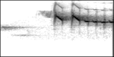
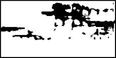
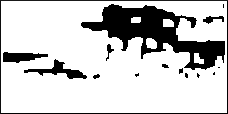

# Blackbird or Robin? - Implementation of a Fully Automated Machine Learning Pipeline for Bird Sound Recognition

#### Josafat-Mattias Burmeister, Maximilian Götz

## Contact

josafat-mattias.burmeister@student.hpi.de

maximilian.goetz@student.hpi.de

## Abstract

<div align="justify">
Audio recorders that capture bird sounds are increasingly used in conservation biology to monitor bird populations. However, labeling the collected audio data requires trained ornithologists and is a very time-consuming task. Using deep learning models trained on spectrogram images, significant progress has been made in recent years to automate this labeling process. To streamline the training and hyperparameter tuning of such models, this work implements an end-to-end machine learning pipeline for the automated recognition of bird vocalizations in audio recordings. The presented pipeline can be run both as a Jupyter notebook and as a Kubeflow pipeline. It includes steps for collecting and downloading suitable training and evaluation data, for preprocessing and filtering the data, and for training, tuning, and evaluating deep learning models on the data. An example dataset with ten different bird sound classes from the Xeno-Canto database and the NIPS4BPlus dataset are used to evaluate the pipeline. On the Xeno-Canto test set, a macro F<sub>1</sub>-score of 72.6% is achieved, with F<sub>1</sub>-scores for all classes above 66%. On the more difficult NIPS4BPlus dataset, a macro F<sub>1</sub>-score of 31.4 % is achieved.
</div>

## 1 Motivation

<div align="justify">

Estimates of bird populations are an essential element in conservation biology for determining the conservation status of bird species and for planning conservation measures [[32](#cite-monitoring-overview), [30](#cite-audio-monitoring)]. Therefore, monitoring programs exist for many bird species in which the abundance of the target species is regularly surveyed in selected study areas. Conventionally, monitoring is conducted by trained ornithologists who record observed species and individuals using standardized methods [[32](#cite-monitoring-overview)]. In recent years, monitoring by human observers has been increasingly complemented by passive acoustic monitoring with audio recorders. The use of audio recorders reduces bias caused by human disturbances and allows for data collection on a larger spatial and temporal scale [[30](#cite-audio-monitoring)]. However, labeling and interpreting the collected audio files requires trained ornithologists and is a very time-consuming task. Using machine learning, significant progress has been made in recent years to automate the labeling process. In particular, deep convolutional neural networks that treat audio classification as an image classification problem have emerged as a promising approach [[37](#cite-sprengel-2016), [33](#cite-sevilla-2017), [20](#cite-lasseck2018), [22](#cite-lasseck2019), [19](#cite-koh2019), [27](#cite-muehling2020), [1](#cite-bai-2020)]. However, since the classification of bird vocalizations is associated with various challenges, the problem has not yet been fully solved. One challenge is that audio recordings often contain background noise and overlapping vocalizations of multiple bird species. In addition, the songs of some bird species differ between individuals and regions. Moreover, most publicly available training data are only weakly labeled at file level and do not include temporal annotations [[26](#cite-nips4bplus)].

Since different monitoring projects focus on different bird species and research questions, separate models are usually required for each monitoring project. To reduce the effort of training and fine-tuning such models, this work aims to implement a fully automated machine learning pipeline for recognition of bird sounds in audio recordings. In previous work on bird sound recognition, deep convolutional neural networks trained on spectrogram images have performed very well. Therefore, we adopt this approach and focus our pipeline design on training such models. To support a wide range of applications, we aim for a flexible pipeline design in terms of the training dataset and model architecture used. To be able to tailor the training settings to the dataset used, the pipeline should also support tuning of model hyperparameters.

</div>

## 2 Related Work

<div align="justify">

An important stimulus for research in automatic bird sound recognition is the _BirdCLEF_ challenge, which has been held annually since 2014 [[4](#cite-bird-clef-2014), [6](#cite-bird-clef-2015), [7](#cite-bird-clef-2016), [8](#cite-bird-clef-2017), [9](#cite-bird-clef-2018), [15](#cite-bird-clef-2019), [17](#cite-bird-clef-2020)]. The objective of this challenge is to recognize bird vocalizations in so-called _soundscape_ recordings, which are longer, omnidirectional audio recordings that usually contain a variety of bird vocalizations [[7](#cite-bird-clef-2016)]. However, the provided training data in the BirdCLEF challenge consists mainly of so-called _focal_ recordings from the _Xeno-Canto_ database, which usually contain vocalizations of only one species at a time [[7](#cite-bird-clef-2016)]. The Xeno-Canto database is a public database that collects audio recordings of bird vocalizations worldwide. These recordings are usually a few minutes long and are typically focused on the vocalizations of a single individual. The Xeno-Canto database provides various metadata about the recordings, such as the recording location, recording quality, and the age and sex of the recorded bird [[41](#cite-xeno-canto)].

Besides the Xeno-Canto database, several other datasets that include recordings of bird vocalizations are publicly available. These include the _Chernobyl_ dataset [[16](#cite-chernobyl)], the _Warblr_ dataset [[40](#cite-warblr)], the _freefield1010_ dataset [[39](#cite-freefield1010)], the _PolandNFC_ dataset [[40](#cite-warblr), [31](#cite-poland-nfc)], the _Birdvox-Full-Night_ dataset [[25](#cite-birdvox)], and the _NIPS4B_ dataset [[26](#cite-nips4bplus)]. While the other datasets mentioned before only include presence-absence tags for bird vocalizations, the NIPS4B dataset also provides species tags [[26](#cite-nips4bplus)]. The _NIPS4BPlus_ dataset provides time-precise annotations of bird vocalizations for a subset of the recordings in the NIPS4B dataset [[26](#cite-nips4bplus)].

Over the last years, various approaches to automated bird sound recognition have been investigated. Lassek approached the problem with random forests trained on low-level features of audio files and statistical features of spectrograms [[21](#cite-lasseck2013), [24](#cite-lasseck2014), [23](#cite-lasseck2015)]. Müller and Marti employed recurrent neural networks (RNNs) for bird sound recognition, namely an LSTM architecture [[28](#cite-muller2018)]. However, deep convolutional neural networks (DCNNs) have emerged as the most promising approach. In order to use convolutional neural networks for audio classification, spectrogram images are generated from the audio data, turning the audio classification task into an image classification task. In recent years, this approach has produced very good results in the BirdCLEF challenge [[37](#cite-sprengel-2016), [33](#cite-sevilla-2017), [20](#cite-lasseck2018), [22](#cite-lasseck2019), [19](#cite-koh2019), [27](#cite-muehling2020), [1](#cite-bai-2020)].

For example, Sprengel et al. won the BirdCLEF challenge in 2016 by training a CNN with five convolutional layers on fixed-size spectrograms. In order to identify relevant sections of the audio files when generating the spectrograms, Sprengel et al. implemented a noise filtering algorithm. A sequence of image filters such as median thresholding, erosion filtering, and dilation filtering was used to separate noise pixels from signal pixels. To artificially enlarge the training set, Sprengel et al. employed data augmentation techniques such as time shifts, pitch shifts, and background noise [[37](#cite-sprengel-2016)].

In their winning submission to the 2017 BirdCLEF challenge, Sevilla and Glotin used an Inception-v4 model. The model was trained using transfer learning and standard augmentation techniques, such as random hue, contrast, brightness, and saturation modifications. To guide the model's focus to relevant spectrogram regions, attention layers were added to Inception-v4 architecture [[33](#cite-sevilla-2017)]. Building upon the results of Sevilla and Glotin, Lassek achieved first place in the BirdCLEF challenge in 2018 and 2019. In both submissions, Lassek used the Inception-v3 architecture because it outperformed other model architectures he tested (ResNet152, DualPathNet92, Inception-v4, DenseNet, InceptionResNet-v2, Xception, NasNet). To segment audio files into noise and signal parts, an image filter-based algorithm was used as in Sprengel et al. [[20](#cite-lasseck2018), [22](#cite-lasseck2019)]. While Sevilla and Glotin applied data augmentation only in the frequency domain [[33](#cite-sevilla-2017)], Lassek also used time-domain data augmentation techniques. Time-domain augmentation techniques used included extracting chunks at random positions of the audio files, jittering the chunk length, and adding noise chunks or chunks of the same bird species. Lassek also made use of ensemble models combining multiple DCNN models with different architectures and training settings [[20](#cite-lasseck2018), [22](#cite-lasseck2019)]. Following a similar approach, Koh et al. achieved second place in the BirdCLEF challenge in 2019. In their work, ResNet18 and Inception-v3 models were trained on Mel-scaled spectrograms and noise filtering was also applied in the image domain. To address class imbalances of the data, standard data augmentation techniques were used, e.g. brightness adjustments, blurring, slight rotations, crops and background noise [[19](#cite-koh2019)].

Since the BirdCLEF challenge in 2020 prohibeted the use of pre-trained networks, Mühling et al. extended previous works by performing a network architecture search. To identify a well performing DCNN architecture, an evolutionary search algorithm with a limited number of layer types and operations was used. Gabor filters were used to integrate spectrogram generation into the network, allowing the model to be trained directly on audio data. To increase model robustness, various data augmentation methods such as pitch shifting, volume modifications and noise addition were applied to the audio data [[27](#cite-muehling2020)].

</div>

## 3 Our Approach

### 3.1 Use Case Specification

<div align="justify">

Our work aims to implement an end-to-end machine learning pipeline that automates the training of bird sound recognition models. Based on promising results of previous works, we focus on training deep convolutional neural networks trained as image classification models on spectrograms. For data preprocessing and spectrogram creation, we largely follow the approach described by Koh et al. [[19](#cite-koh2019)]. With respect to the dataset and model architecture used, we aim for a flexible and extensible pipeline design.

To demonstrate and evaluate the capability of our pipeline, we consider the following use case: As the primary data source, we use the Xeno-Canto database [[41](#cite-xeno-canto)], which is the largest publicly available collection of bird sound recordings. To create input images for the DCNN models, we convert the audio files from Xeno-Canto into spectrograms. The audio recordings from Xeno-Canto usually focus on the vocalizations of a single bird species, but may include other bird vocalizations in the background. Since the Xeno-Canto database provides bird species labels only at the file level, but no time-accurate annotations, we only use the focal species as spectrogram label and ignore the labels for background species. In contrast to the recordings in Xeno-Canto, recordings from monitoring projects usually contain multiple overlapping bird vocalizations and different background noises. To produce models that generalize to such use cases, we train multi-label classification models, even though our training data is single-label data. To evaluate the performance of our models in such a scenario, we use the NIPS4BPlus dataset as an additional test dataset [[26](#cite-nips4bplus)]. In order to obtain time-accurate predictions, we split the audio files into 1-second chunks and create separate spectrograms and thus separate predictions for each chunk.

</div>

### 3.2 Pipeline Architecture

<div align="justify">

Conceptually, our machine learning pipeline consists of the following four stages ([Figure 1](#fig-pipeline)):

1. Download of audio data and labels

2. Conversion of audio files into spectrogram images and separation of spectrograms into "signal" spectrograms containing bird vocalizations and "noise" spectrograms containing only background sounds

3. Training of DCNN image classification models on the spectrograms and tuning of model hyperparameters

4. Model evaluation on test datasets

All pipeline steps are implemented by Python classes, which are described in more detail in the following sections. To support a wide range of applications, our pipeline can be run as both a Jupyter notebook[<sup>1</sup>](#footnote-1) and a Kubeflow pipeline.[<sup>2</sup>](#footnote-2) Both variants use the same Python implementation, with the user interface of our Kubeflow pipeline mapping directly to the interfaces of our Python classes.


**Figure <a name="fig-pipeline">1</a>:** Architecture of our machine learning pipeline for bird sound recognition.

<a name="footnote-1"><sup>1</sup></a> https://jupyter.org

<a name="footnote-2"><sup>2</sup></a> https://www.kubeflow.org

</div>

### Pipeline Stage 1: Data Download

<div align="justify">

The downloader stage of the pipeline is responsible for downloading the audio files and labels needed for model training and evaluation, and converting them into a consistent format. For this purpose, we provide a generic downloader implementation, based on which downloaders for specific datasets can be implemented.

As mentioned above, we use audio data from the Xeno-Canto database (for model training, validation and testing) as well as the NIPS4BPlus dataset (for model testing) to demonstrate the capability of our pipeline. The download of both datasets is implemented by separate downloader classes that inherit from our generic downloader base class. To download audio files from Xeno-Canto, the public Xeno-Canto API[<sup>3</sup>](#footnote-3) is used. The Xeno-Canto API allows searching for audio files based on a set of filter criteria (e.g., bird species, recording location, recording quality, and recording duration). The search returns the metadata of the matching audio files in JSON format, including download links for the audio files ([Listing 1](#listing-xeno-canto-json)). Our Xeno-Canto downloader implementation incorporates most of the filter criteria of the Xeno-Canto API and compiles training, validation, and test sets based on the filter values. Our NIPS4BPlus downloader, on the other hand, only supports filtering by bird species and sound category, since no other metadata is available for the NIPS4Bplus dataset.

```javascript
[
  {
    id: "567435",
    gen: "Petronia",
    sp: "petronia",
    en: "Rock Sparrow",
    rec: "Testaert Dominique",
    cnt: "France",
    loc: "Albussac, Corr\u00e8ze, Nouvelle-Aquitaine",
    lat: "45.1485",
    lng: "1.8464",
    alt: "420",
    type: "adult, male, song",
    url: "//www.xeno-canto.org/567435",
    file: "//www.xeno-canto.org/567435/download",
    "file-name": "XC567435-20200610 11h21 Moineau soulcie.mp3",
    length: "0:08",
    time: "11:21",
    date: "2020-06-10",
    uploaded: "2020-06-11",
    also: [],
    "bird-seen": "yes",
    "playback-used": "no",
  },
];
```

**Listing <a name="listing-xeno-canto-json">1</a>:** Example result of a search query to the Xeno-Canto API.

To speed up the download phase, local caching of files is used in addition to multithreading. This way, successive pipeline runs do not have to download the same files more than once. When the pipeline is run as a Jupyter notebook, a regular directory on the local disk is used for caching. When the pipeline is run as a Kubeflow pipeline, a _Google Cloud Storage_[<sup>4</sup>](#footnote-4) bucket is used for file caching.

<a name="footnote-3"><sup>3</sup></a> https://www.xeno-canto.org/explore/api

<a name="footnote-4"><sup>4</sup></a> https://cloud.google.com/products/storage

### Stage 2: Spectrogram Creation

For spectrogram creation, we largely follow the approach described by Kot et al. [[19](#cite-koh2019)]. As in the work of Koh et al., we divide the audio files into non-overlapping 1-second chunks and create one mel-scale log-amplitude spectrogram for each chunk. The spectrogram creation is based on a short-time Fourier transform (STFT) of the amplitude signal, for which we use the Python sound processing library _Librosa_.<sup>[5]</sup>(#footnote-5) We choose the parameters of the STFT such that the resulting spectrograms have a size of approximately 224 x 112 pixels. [Table 1](#table-spectrogram-parameters) provides an overview of our STFT parameter settings, which are largely consistent with those of Koh et al. [[19](#cite-koh2019)]. The resulting spectrogram images are normalized and stored as inverted grayscale images, so that high amplitudes are represented by dark pixels.

**Table <a name="table-spectrogram-parameters">1</a>**: Parameter settings of the short-time Fourier transform used for spectrogram creation.

| Parameter         | Value     |
| ----------------- | --------- |
| Sampling rate     | 44,100 Hz |
| Window length     | 1,024     |
| Hop length        | 196       |
| Minimum frequency | 500 Hz    |
| Maximum frequency | 15,000 Hz |

Since the audio files from Xeno-Canto are only annotated at file level, it is uncertain which parts of the audio recordings contain bird vocalizations. To separate spectrograms that contain bird vocalizations from spectrograms that contain only noise, we employ the noise filtering algorithm described by Kahl et al. [[14](#cite-kahl-2017)].[<sup>6</sup>](#footnote-6) This algorithm is based on the works of Sprengel et al. [[37](#cite-sprengel-2016)] and Lassek [[21](#cite-lasseck2013)] and has been used in a similar form in many other works [[4](#cite-fazekas-2017), [20](#cite-lasseck2018), [19](#cite-koh2019), [2](#cite-bai-2019), [1](#cite-bai-2020)]. In this algorithm, multiple image filters are applied to each spectrogram to extract the signal pixels of the spectrogram, and then the number of rows containing signal pixels is compared to a threshold value: First, the image is blurred with a median blur kernel of size 5 ([Figure 2b](#fig-noise-filtering-b)). Next, a binary image is created by median filtering. In this step, all pixel values that are 1.5 times larger than the row and the column median are set to black and all other pixels are set to white ([Figure 2c](#fig-noise-filtering-c)). To remove isolated black pixels, spot removal and morphological closing operations are applied ([Figures 2d](#fig-noise-filtering-d), [2e](#fig-noise-filtering-e)). Finally, the number of rows containing signal pixels (black pixels) is compared to a predefined threshold, the _signal threshold_. If the number of signal rows is larger than the signal threshold, the spectrogram is assumed to contain bird vocalizations. If the number of signal rows is below a second threshold, the _noise threshold_, the spectrogram is considered to contain only noise. To have a decision margin, the noise threshold is usually chosen smaller than the signal threshold. To increase the robustness of the models, we do not discard the noise spectrograms, but provide an option to include noise spectrograms for training as a separate class.

<div style="display: flex; flex-direction: column;">
    <div>
        <div style="display: flex;">
        
        
        
        </div>
        <p style="text-align: center; margin: 10px 0px;"><a name="fig-noise-filtering-a">(a)</a> Original spectrograms.</p>
    </div>
    <div>
        <div style="display: flex;">
        
        
        
        </div>
        <p style="text-align: center; margin: 10px 0px;"><a name="fig-noise-filtering-b">(b)</a> Spectrograms after median blurring.</p>
    </div>
    <div>
        <div style="display: flex;">
        
        
        
        </div
        <p style="text-align: center; margin: 10px 0px;"><a name="fig-noise-filtering-c">(c)</a> Spectrograms after median filtering.</p>
    </div>
    <div>
        <div style="display: flex;">
        
        
        
        </div>
        <p style="text-align: center; margin: 10px 0px;"><a name="fig-noise-filtering-d">(d)</a> Spectrograms after spot removal.</p>
    </div>
    <div>
        <div style="display: flex;">
        
        
        
        </div>
        <p style="text-align: center; margin: 10px 0px;"><a name="fig-noise-filtering-e">(e)</a> Spectrograms after morphological closing.</p>
    </div>
</div>

**<a name="fig-noise-filtering">Figure 2</a>:** Steps of the noise filtering algorithm described by Kahl et al. [[14](#cite-kahl-2017)] shown by three example spectrograms.

<a name="footnote-5"><sup>5</sup></a> https://librosa.org

<a name="footnote-6"><sup>6</sup></a> https://github.com/kahst/BirdCLEF2017/blob/f485a3f9083b35bdd7a276dcd1c14da3a9568d85/birdCLEF_spec.py#L131

### Stage 3: Model Training

The model training stage of our pipeline can be either used to train DCNN models with specified hyperparameters or to tune the model hyperparameters. It is implemented using the _Pytorch_ framework[<sup>7</sup>](#footnote-7) and the _Torchvision_ library.[<sup>8</sup>](#footnote-8) Building on Torchvision conventions, the training stage is designed in such a way that the model architecture used can be exchanged easily. For our use case, we mainly use the ResNet18 architecture [[11](#cite-resnet)], as it has been successfully applied to bird sound classification in previous work [[19](#cite-koh2019)]. In addition, we also experiment with the ResNet50 and the DenseNet121 architectures [[11](#cite-resnet), [12](#cite-densenet)]. Our implementation supports training of both single-label and multi-label classification models. However, for our use case, we only use multi-label models since multiple bird vocalizations may occur simultaneously in some recordings.

The models are trained using a transfer learning approach. For this, we use models from the Torchvision Library that were pre-trained on the ImageNet dataset [[3](#cite-image-net)]. We replace the fully-connected layers of the pre-trained models with classifiers suited to our classification tasks and then fine-tune some of the model's layers on our data. Our implementation supports various degrees of transfer learning, which range from re-training only the fully connected layer to fine-tuning all model layers.

To prevent the models from overfitting the training data, we implement both L<sub>2</sub>-regularization and dropout. In L<sub>2</sub>-regularization, a penality term is added to the loss function that penalizes large parameter values. In our implementation, regularization is jointly applied to all model parameters. In this way, the model space is constrained in favor of less complex models. However, the weighting factor of the regularization term represents an additional model hyperparameter that needs to be tuned: If the weighting factor of the regularization term is too high, the model will not become sufficiently complex to learn the relevant characteristics of the data. On the other hand, if the weighting of the regularization term is too low, the model is not sufficiently prevented from overfitting to the training data. Dropout is a different approach to reduce overfitting: In this method, randomly selected neurons are dropped during training. In this way, only a subset of the network weights is trained in each iteration. When the network is trained over multiple iterations, a different subnetwork is trained in each iteration. At test time, all model weights are used, which might result in an overall network with higher predictive power [[38](#cite-dropout)]. In our implementation, dropout is applied immediately before the fully connected layer and some of its inputs are randomly set to zero. The probability with which the inputs are zeroed out is called dropout rate and represents a model hyperparameter that also needs to be tuned.

To select the best model from each training run, we use the macro-averaged F<sub>1</sub>-score (macro F<sub>1</sub>-score) as primary performance metric. The macro F<sub>1</sub>-score is the unweighted average of the F<sub>1</sub>-scores of all classes. Thus, it weights all classes equally and is therefore suitable for our use case, where model performance on rare classes is as important as performance on frequent classes. In addition to the macro F<sub>1</sub>-score, we also monitor the performance metrics of each class (F<sub>1</sub>-score, precision, and recall) as well as the minimum of the class-wise F<sub>1</sub>-scores as additional performance indicators. To track and visualize the performance metrics, we use the _Weights and Biases_ platform.[<sup>9</sup>](#footnote-9)

<a name="footnote-7"><sup>7</sup></a> https://pytorch.org

<a name="footnote-8"><sup>8</sup></a> https://pytorch.org/vision/stable/index.html

<a name="footnote-9"><sup>9</sup></a> http://wandb.ai/

### Stage 4: Model Evaluation

In the model evaluation stage, the best models from the training stage are evaluated on test datasets that have not been used for model training or validation. Specifically, the following models are selected for evaluation:

1. Model with the highest macro F<sub>1</sub>-score

2. Model with the highest minimum class-wise F<sub>1</sub>-score

3. Models with the highest F<sub>1</sub>-scores for a each class

In our use case, we use test data from Xeno-Canto and the NIPS4BPlus dataset to evaluate the models' performances. As in the training stage, the macro-average F<sub>1</sub>-score is used as the primary evaluation metric. Although model evaluation is conceptually a separate pipeline stage, in our Kubeflow pipeline we have implemented model training and evaluation as a joint pipeline component for performance reasons.

</div>

### Data Exchange Between Pipeline Stages

<div align="justify">

In Kubeflow pipelines, all outputs of the pipeline stages are stored as files and can be used as inputs for subsequent pipeline stages. Persisting the outputs increases the pipeline's robustness and facilitates failure recovery. Therefore, we follow this approach and use purely file-based interfaces to exchange data between the different stages of our pipeline. In the following, we describe these file-based interfaces in detail.

[Listing 2](#listing-directory-structure-downloader) shows an example of the directory structure that is used to pass data between the data download and the spectrogram creation stage. As shown, the data download stage is required to create a file named "categories.txt" as well as a number of subdirectories, representing different datasets or different parts of a dataset (e.g., training, validation, and test set). The file "categories.txt" contains a line-by-line listing of all possible class names that may be used as labels for the audio files ([Listing 3](#listing-categories-file)). Each of the subdirectories (representing different datasets) has to contain a subdirectory named "audio" and a label file named "audio.csv". The subdirectory "audio" contains the audio files of the respective dataset, which can be grouped in further subdirectories. The label file "audio.csv" contains one line per annotated sound event, i.e., per annotated bird vocalization. An example of such a label file is shown in [Table 2](#table-audio-label-file). As shown, the label files must contain at least the following columns:

**id**: Identifier of the audio file that is unique across all datasets.

**file_path**: Path of the audio file relative to the subdirectory containing the dataset.

**start**: Start time of the annotated sound event, specified in milliseconds after the beginning of the audio file.

**end**: End time of the annotated sound event, specified in milliseconds after the beginning of the audio file.

**label**: Class label of the annotated sound event (must be one of the classes listed in the "categories.txt" file).

This label format can be used to support both single-label and multi-label classification tasks. In addition, both temporally annotated and file-level annotated datasets can be processed. In the latter case, only one label is created per file, with the start time set to 0 and the end time set to the length of the audio file in milliseconds.

```
├── categories.txt
├── train
│   ├── audio
│   │   ├── 368261.mp3
│   │   ├── 619980.mp3
│   │   └── ...
│   └── audio.csv
├── val
│   ├── audio
│   │   └── ...
│   └── audio.csv
└── test
    ├── audio
    │   └── ...
    └── audio.csv
```

**Listing <a name="listing-directory-structure-downloader">2</a>**: Example of the directory structure that is used to pass data between the data download and the spectrogram creation stage of our pipeline.

```
Turdus_merula_song
Turdus_merula_call
Erithacus_rubecula_song
Erithacus_rubecula_call
```

**Listing <a name="listing-categories-file">3</a>**: Example of a "categories.txt" file used in our pipeline to list the labels used in a dataset.

**Table <a name="table-audio-label-file">2</a>**: Example of a label file in CSV format used for audio file labeling in our pipeline.

| id     | file_path  | start | end    | label                   |
| ------ | ---------- | ----- | ------ | ----------------------- |
| 368261 | 368261.mp3 | 0     | 47000  | Turdus_merula_song      |
| 619980 | 619980.mp3 | 0     | 11000  | Erithacus_rubecula_call |
| 619980 | 619980.mp3 | 11000 | 174000 | Turdus_merula_call      |

[Listing 4](#listing-directory-structure-spectrogram-creation) shows an example of the directory structure that is used to pass data between the spectrogram creation and the model training stage. It is very similar to the directory structure that is used as input of the spectrogram creation stage ([Listing 2](#listing-directory-structure-downloader)). As shown, the output directory of the spectrogram creation stage also has to contain a "categories.txt" file which matches the format shown in [Listing 3](#listing-categories-file). In addition, the spectrogram creation stage has to create a subdirectory named "spectrograms" and a label file "spectrograms.csv" for each dataset. The "spectrograms" subdirectory contains the spectrogram images of the respective dataset. The label file "spectrograms.csv" has to contain one label per spectrogram image. As shown in [Table 3](#table-spectrogram-label-file), it must contain at least the columns "id", "file_path" and one column per label class containing binary presence-absence labels.

```
├── categories.txt
├── train
│   ├── spectrograms
│   │   ├── 368261-0.png
│   │   ├── 368261-1_noise.png
│   │   ├── ...
│   │   ├── 619980-0.png
│   │   └── ...
│   └── spectrograms.csv
├── val
│   ├── spectrograms
│   │   └── ...
│   └── spectrograms.csv
└── test
    ├── spectrograms
    │   └── ...
    └── spectrograms.csv
```

**Listing <a name="listing-directory-structure-spectrogram-creation">4</a>**: Example of the directory structure that is used to pass data between the spectrogram creation and the model training stage of our pipeline.

**Table <a name="table-spectrogram-label-file">3</a>**: Example of a label file in CSV format used for spectrogram labeling in our pipeline.

| id     | file_path    | Turdus_merula_song | Turdus_merula_call | Erithacus_rubecula_song | Erithacus_rubecula_call |
| ------ | ------------ | ------------------ | ------------------ | ----------------------- | ----------------------- |
| 368261 | 368261-0.png | 1                  | 0                  | 0                       | 0                       |
| 368261 | 368261-1.png | 1                  | 0                  | 0                       | 0                       |
| 619980 | 619980-0.png | 0                  | 0                  | 0                       | 1                       |

</div>

## 4 Experiments

<div align="justify">

To evaluate the performance of our pipeline, we use a sample dataset with ten classes of bird vocalizations. The ten classes are those classes of the NIPS4BPlus dataset for which most recordings exist in Xeno-Canto. Our main dataset was compiled from recordings from Xeno-Canto. For our baseline experiments and hyperparameter tuning, only recordings that do not contain background species, have audio quality "A", and a duration of at most 180 seconds were used. A maximum of 500 audio recordings were used per class, with 60% of the recordings used for model training and 20% each for model validation and testing. The class distribution of all data splits is shown in [Table 4](#table-xeno-canto-dataset) and Figure [3](#fig-class-distribution-audio-files). The number of spectrograms per class depends on the number and length of audio recordings and ranges from 5,374 to 22,291 spectrograms per class in the training set (Figure [4](#fig-class-distribution-spectrograms)). To avoid strong imbalances, the number of noise spectrograms included in the data splits was limited to the number of spectrograms of the most common bird vocalization class. Figure [5](#fig-example-spectrograms) shows examples of spectrograms of all ten classes.

For the model testing, the NIPS4BPlus dataset was used in addition to the Xeno-Canto data. The NIPS4Bplus dataset was used in two different forms, which we call "NIPS4BPlus" and "filtered NIPS4BPlus". While the first form contains all audio recordings of the NIPS4BPlus dataset, the second form contains only recordings that contain at least one of the ten classes of our dataset. The class distribution of both variants is given in [Table 5](#table-nips4bplus-dataset).

**Table <a name="table-xeno-canto-dataset">4</a>:** Class distribution of the Xeno-Canto dataset used for training the baseline models and for tuning hyperparameters.

| Class name                    | No. recordings in training set | No. spectrograms in training set | No. recordings in validation set | No. spectrograms in validation set | No. recordings in test set | No. spectrograms in test set |
| ----------------------------- | ------------------------------ | -------------------------------- | -------------------------------- | ---------------------------------- | -------------------------- | ---------------------------- |
| Cyanistes caeruleus, song     | 163                            | 5,374                            | 55                               | 1,426                              | 55                         | 1,407                        |
| Erithacus rubecula, song      | 300                            | 13,269                           | 100                              | 4,668                              | 100                        | 5,027                        |
| Fringilla coelebs, song       | 300                            | 9,890                            | 100                              | 3,145                              | 100                        | 3,260                        |
| Luscinia megarhynchos, song   | 298                            | 18,156                           | 99                               | 5,817                              | 100                        | 6,472                        |
| Parus major, song             | 300                            | 11,026                           | 100                              | 3,721                              | 100                        | 3,552                        |
| Phylloscopus collybita, call  | 201                            | 4,990                            | 67                               | 1,352                              | 68                         | 1,599                        |
| Phylloscopus collybita, song  | 300                            | 12,474                           | 100                              | 4,219                              | 100                        | 4,006                        |
| Sylvia atricapilla, song      | 300                            | 14,786                           | 100                              | 5,304                              | 100                        | 4,968                        |
| Troglodytes troglodytes, song | 300                            | 11,001                           | 100                              | 2,990                              | 100                        | 3,225                        |
| Turdus philomelos, song       | 300                            | 22,291                           | 100                              | 6,901                              | 100                        | 6,995                        |
| Noise                         | -                              | 22,291                           | -                                | 6,901                              | -                          | 6,995                        |
| **Total**                     | **2,762**                      | **145,548**                      | **921**                          | **46,444**                         | **923**                    | **47,506**                   |

**Table <a name="table-nips4bplus-dataset">5</a>:** Class distribution of the NIPS4BPlus dataset used for model evaluation.

| Class name                                   | No. recordings in NIPS4BPlus dataset | No. spectrograms in NIPS4BPlus dataset |
| -------------------------------------------- | ------------------------------------ | -------------------------------------- |
| Cyanistes caeruleus, song                    | 9                                    | 30                                     |
| Erithacus rubecula, song                     | 19                                   | 47                                     |
| Fringilla coelebs, song                      | 12                                   | 24                                     |
| Luscinia megarhynchos, song                  | 18                                   | 38                                     |
| Parus major, song                            | 15                                   | 40                                     |
| Phylloscopus collybita, call                 | 9                                    | 12                                     |
| Phylloscopus collybita, song                 | 14                                   | 31                                     |
| Sylvia atricapilla, song                     | 8                                    | 17                                     |
| Troglodytes troglodytes, song                | 9                                    | 31                                     |
| Turdus philomelos, song                      | 17                                   | 55                                     |
| Noise (whole NIPS4BPlus dataset)             | 549                                  | 2147                                   |
| Noise (filtered NIPS4BPlus dataset)          | 87                                   | 333                                    |
| **Total (filtered NIPS4BPlus / NIPS4BPlus)** | **107 / 569**                        | **486 / 2,300**                        |


**Figure <a name="fig-class-distribution-audio-files">3</a>:** Number of audio recordings per class for the Xeno-Canto dataset used for training the baseline models and for tuning hyperparameters.


**Figure <a name="fig-class-distribution-spectrograms">4</a>:** Number of spectrograms per class for the Xeno-Canto dataset used for training the baseline models and for tuning hyperparameters.

<div style="display: flex; flex-direction: column;">
    <div>
        <div style="display: flex;">
        
        
        </div>
        <p style="text-align: center; margin: 10px 0px;"><a name="fig-example-spectrograms-a">(a)</a> <i>Cyanistes caeruleus</i>, song.</p>
    </div>
    <div>
        <div style="display: flex;">
        
        
        </div>
        <p style="text-align: center; margin: 10px 0px;"><a name="fig-example-spectrograms-b">(b)</a> <i>Erithacus rubecula</i>, song.</p>
    </div>
    <div>
        <div style="display: flex;">
        
        
        </div>
        <p style="text-align: center; margin: 10px 0px;"><a name="fig-example-spectrograms-c">(c)</a> <i>Fringilla coelebs</i>, song.</p>
    </div>
    <div>
        <div style="display: flex;">
        
        
        </div>
        <p style="text-align: center; margin: 10px 0px;"><a name="fig-example-spectrograms-d">(d)</a> <i>Luscinia megarhynchos</i>, song.</p>
    </div>
    <div>
        <div style="display: flex;">
        
        
        </div>
        <p style="text-align: center; margin: 10px 0px;"><a name="fig-example-spectrograms-e">(e)</a> <i>Parus major</i>, song.</p>
    </div>
    <div>
        <div style="display: flex;">
        
        
        </div>
        <p style="text-align: center; margin: 10px 0px;"><a name="fig-example-spectrograms-f">(f)</a> <i>Phylloscopus collybita</i>, call.</p>
    </div>
    <div>
        <div style="display: flex;">
        
        
        </div>
        <p style="text-align: center; margin: 10px 0px;"><a name="fig-example-spectrograms-g">(g)</a> <i>Phylloscopus collybita</i>, song.</p>
    </div>
    <div>
        <div style="display: flex;">
        
        
        </div>
        <p style="text-align: center; margin: 10px 0px;"><a name="fig-example-spectrograms-h">(h)</a> <i>Sylvia atricapilla</i>, song.</p>
    </div>
    <div>
        <div style="display: flex;">
        
        
        </div>
        <p style="text-align: center; margin: 10px 0px;"><a name="fig-example-spectrograms-i">(i)</a> <i>Troglodytes troglodytes</i>, song.</p>
    </div>
    <div>
        <div style="display: flex;">
        
        
        </div>
        <p style="text-align: center; margin: 10px 0px;"><a name="fig-example-spectrograms-j">(j)</a> <i>Turdus philomelos</i>, song.</p>
    </div>
</div>

**Figure <a name="fig-example-spectrograms">5</a>:** Examples of spectrograms of the ten classes of our data set.

### 4.1 Baseline Setting

To establish a baseline for our experiments, we first trained a model with a standard setting ([Table 6](#table-baseline-setting)). We trained the model as a multi-label classification model with a confidence threshold of 0.5. To account for noise factors such as data shuffling and random weight initialization, we performed three training runs. From each of the three runs, we selected the model with the highest macro-average F<sub>1</sub>-score and report the average of the macro F<sub>1</sub>-scores of these best models.

**Table <a name="table-baseline-setting">6</a>:** Training setting of our baseline model

| Parameter               | Baseline Setting                                                  |
| ----------------------- | ----------------------------------------------------------------- |
| Model architecture      | ResNet18                                                          |
| Fine-tuned model layers | conv. layer 3-4, fc.                                              |
| Optimizer               | Adam                                                              |
| Learning rate           | 0.0001                                                            |
| Learning rate scheduler | cosine annealing learning rate scheduler with η<sub>min</sub> = 0 |
| Batch size              | 1024                                                              |
| Loss function           | Cross-entropy loss                                                |

### 4.2 Hyperparameter-Tuning

With the goal of improving the performance of our baseline models, we tuned several model hyperparameters. The tuned hyperparameters were batch size, learning rate, strenth of L<sub>2</sub>-regularization (weight decay), probability of dropout, and the number of layers fine-tuned during transfer learning. Since some authors report a linear dependence between batch size and learning rate [[10](#cite-goyal-linear-scaling), [13](#cite-jastrzebski-linear-scaling), [29](#cite-myrtle-hyperparameter)], we have tuned these parameters in a paired fashion. All other hyperparameters were tuned independently, assuming that there are no dependencies between them. When tuning batch size and learning rate, a constant learning rate was used in each run without using a learning rate scheduler. A cosine learning rate scheduler with an initial learning rate of 10<sup>-4</sup> was used in the other hyperparameter tunings. All other hyperparameters were set to the same values as in the baseline experiment ([Table 6](#table-baseline-setting)). As in the baseline experiment, three training runs were performed for each hyperparameter setting to be tested and the average macro F<sub>1</sub>-score of the three runs was calculated. Each training run comprised a maximum of 10 epochs. An early stopping mechanism was used to stop the training runs if the macro F<sub>1</sub>-score did not improve in the last three training epochs.

### 4.3 Additional Data

In addition to hyperparameter tuning, we also studied how quality and size of the training dataset affect model performance. For this purpose, we compared the performance of our baseline model with the performance of models trained on two modified training datasets. Both of these datasets use the same ten bird sound classes as the baseline dataset. For the first dataset, we used a maximum of 500 audio recordings samples per class, as in the baseline dataset, but included Xeno-Canto recordings with lower audio quality. For this, we decreased the minimum recording quality to "E" and increased the maximum number of background species to 10. For simplicity, we refer to this dataset as the "noisy data" dataset in the following. In the second dataset, the same quality settings were used as in the "noisy data" dataset, but the maximum number of audio files per class was increased to 1000. In the following, this data set will be referred to as the "more data" data set.

</div>

# 5 Results and Discussion

<div align="justify">

### 5.1 Baseline Setting

On the Xeno-Canto validation set, our three baseline runs achieved an average macro F<sub>1</sub>-score of 0.741 ± 0.003 (at a confidence threshold of 0.5). The performance on the Xeno-Canto test set was similar, with an average macro F<sub>1</sub>-score of 0.736 ± 0.001 (at a confidence threshold of 0.5). As shown in [Figure 6](#fig-baseline-overfitting), the training of our baseline models was characterized by overfitting, with all models reaching training F<sub>1</sub>-scores close to one after 15-20 epochs. The best performance on the validation set was achieved between the fourth and sixth training epoch in all baseline runs.


**Figure <a name="fig-baseline-overfitting">6</a>:** Macro F<sub>1</sub>-scores of one of our three baseline runs on the training and test set.


**Figure <a name="fig-baseline-confidence">7</a>:** Average macro F<sub>1</sub>-scores of the baseline models at different confidence thresholds.

On the NIPS4BPlus dataset, the performance of the baseline models was significantly worse than on the Xeno-Canto data. As can be seen in [Figure 7](#fig-baseline-confidence), the confidence of the baseline models on the NIPS4BPlus dataset was significantly lower than on the Xeno-Canto test set. We therefore experimented with multiple confidence thresholds and found that for the NIPS4BPlus dataset, the best classification results are obtained at a low confidence threshold of 0.1. At this threshold, the average macro F<sub>1</sub>-score was 0.258 ± 0.009, and at a confidence threshold of 0.5, it was only 0.139 ± 0.007. On the filtered NIPS4BPlus dataset, the performance was similar, with a macro F<sub>1</sub>-score of 0.266 ± 0.012 at a confidence threshold of 0.1 and of 0.139 ± 0.003 at a confidence threshold of 0.5.

We presume that the poor performance on the NIPS4BPlus dataset is due to the following differences between the training data from Xeno-Canto and the NIPS4BPlus dataset: While the Xeno-Canto training dataset consists mainly of focal recordings directed to the vocalizations of a specific individual, the recordings of the NIPS4BPlus dataset were collected with field recorders that were not directed to a specific individual. Accordingly, some bird vocalizations in the NIPS4BPlus dataset are quieter than in the Xeno-Canto training dataset. Additionally, some recordings in the NIPS4BPlus dataset contain stronger background noise, such as wind. Apparently, the baseline models overfit to the features of the clean Xeno-Canto data and thus lack robustness in classifying the more difficult NIPS4BPlus data.


**Figure <a name="fig-baseline-class-scores">8</a>:** Average class-wise F<sub>1</sub>-scores of the three baseline models on the Xeno-Canto training, validation, and test sets and the NIPS4BPlus dataset. For the Xeno-Canto data, classification results at a confidence threshold of 0.5 are shown. For the NIPS4BPlus dataset, classification results at a confidence threshold of 0.1 are shown. The error bars show the standard deviation.

As shown in [Figure 8](#fig-baseline-class-scores), the class-wise F<sub>1</sub>-scores on the Xeno-Canto validation and test sets were very similar for most classes. On both the validation and test sets, "_Phylloscopus collybita_, call" was the class with the highest F<sub>1</sub>-score. On the test set, an average F<sub>1</sub>-score of 0.861 ± 0.002 was obtained for this class. The lowest average F<sub>1</sub>-score on the validation set, 0.645 ± 0.014, was obtained for the class "_Cyanistes caeruleus_, song". On the test set, "_Fringilla coelebs_, song" was the worst performing class with an average F<sub>1</sub>-score of 0.626 ± 0.008.

The F<sub>1</sub>-scores on the NIPS4BPlus dataset were significantly lower than on the Xeno-Canto data for most classes. Some classes for which high classification accuracies were achieved on the Xeno-Canto data had very low F<sub>1</sub>-scores on the NIPS4BPlus dataset. For example, the class "_Phylloscopus collybita_, call", which performed best on the Xeno-Canto data, had an F<sub>1</sub>-score of 0 on the NIPS4BPlus dataset. The highest F<sub>1</sub>-scores on the NIPS4BPlus dataset were obtained for the classes "_Erithacus rubecula_, song" (0.659 ± 0.020) and "_Troglodytes troglodytes_, song" (0.624 ± 0.002).

From our point of view, the differences in performance between classes are mainly related to two factors: the complexity of the sound patterns and the number of training samples. Of the ten sound classes in our dataset, nine classes are bird songs and one class is a call ("_Phylloscopus collybita_, call"). While songs consist of a sequence of different phrases and motives, calls are much less complex. In spectrograms, calls are usually visible as a single pattern, whereas songs are visible as a sequence of patterns ([Figure 5](#fig-example-spectrograms)). In some cases, these sequences are longer than the 1-second chunks represented by the spectrograms we use. We suspect that the models learned best those calls and songs that consist of simple patterns that can be represented by a single spectrogram. For example, on the Xeno-Canto data, the highest classification accuracy was achieved for the call of the common chiffchaff ("_Phylloscopus collybita_, call"), although this is the class with the fewest training samples ([Table 4](#table-xeno-canto-dataset)). As can be seen in [Figure 5f](#fig-example-spectrograms-f), the call of the common chiffchaff appears as a short, simple pattern in the spectrograms. The second highest F<sub>1</sub>-score on the Xeno-Canto data was obtained for the song of the common chiffchaff ("_Phylloscopus collybita_, song"), which consists of a uniform sequence of a simple pattern ([Figure 5g](#fig-example-spectrograms-g)). Similar high F<sub>1</sub>-scores as for the song of the common chiffchaff were obtained for the songs of the nightingale ("_Luscinia megarhynchos_, song") and the song thrush ("_Turdus philomelos_, song"), although these species have very complex songs. However, these species are also represented by a higher number of spectrograms in our training dataset ([Table 4](#table-xeno-canto-dataset)). Therefore, we believe that the number of training samples has a positive effect on model performance and can support the models to learn even complex patterns. Still, for some species whose songs consist of a long sequence of different patterns, 1-second spectrograms may be too short to recognize the species from a single spectorgram. To overcome this problem, either longer spectrograms could be used or recurrent model architectures that receive a sequence of spectrograms as input.

### 5.3 Additional Data

In the previous section, we described and discussed model performance on our baseline dataset. It was shown that the ResNet18 architecture performs well on the the clean and filtered Xeno-Canto data, but performs poorly on the more realistic NIPS4BPlus dataset. Increasing the size of the training dataset and including noisier audio recordings mitigated this issue: As shown in Figure [9](#fig-additonal-data-xeno-canto), both the models trained on the "noisy data" and the "more data" datasets performed slightly worse on the Xeno-Canto data than the baseline models. However, on the NIPS4BPlus dataset, both achieved higher macro F<sub>1</sub>-scores than the baseline models (Figure [10](#fig-additonal-data-nips4bplus) and [11](#fig-additonal-data-nips4bplus-filtered)). This demonstrates that both the size of the training data and its quality affect the models' generalizability. As our results show, it may be useful to reduce the quality of the training data to increase the robustness of the models on realistic datasets with background noise.


**Figure <a name="fig-additonal-data-xeno-canto">9</a>:** Average macro F<sub>1</sub>-scores on the Xeno-Canto test set of models trained on datasets of different size and quality.

of the models trained on the baseline, the "more data" and the "noisy data" datasets.


**Figure <a name="fig-additonal-data-nips4bplus">10</a>:** Average macro F<sub>1</sub>-scores on the NIPS4BPlus dataset of models trained on datasets of different size and quality.


**Figure <a name="fig-additonal-data-nips4bplus-filtered">11</a>:** Average macro F<sub>1</sub>-scores on the filtered NIPS4BPlus dataset of models trained on datasets of different size and quality.

### 5.3 Hyperparameter Tuning

To further improve the performance of our models compared to the baseline setting, we tuned several model hyperparameters. [Figure 12](#fig-tuning-batch-learning-rate) visualizes the results of the paired tuning of batch size and learning rate as a two-dimensional slice of the hyperparameter space. As can be seen there, batch size had less impact on model performance than learning rate, with lower batch sizes tending to produce slightly better results. Independent of the batch size, a learning rate of 0.0001 yielded the highest F<sub>1</sub>-scores. At a learning rate of 10<sup>-6</sup>, performance dropped sharply. For our training setting, we could not observe the linear scaling rule for batch size and learning rate described by some authors [[10](#cite-goyal-linear-scaling), [13](#cite-jastrzebski-linear-scaling), [29](#cite-myrtle-hyperparameter)]. According to this rule, the model performance depends on the ratio between learning rate and batch size. Accordingly, optimal learning rates should be higher for larger batch sizes. However, as Smith et al. show that the linear scaling rule only applies in a "noise dominated" regime that occurs at small or medium batch sizes, but not in a "curvature-dominated" regime that occurs at large batch sizes. According to their results, in a curvature dominated regime, the optimal learning rate is independent of the batch size [[35](#cite-smith2020hyperparameter), [34](#cite-smith2019hyperparameter)]. Since our training setting seems to be mainly in a "curvature-dominated" regime, we conclude that batch size and learning rate can be tuned independently in our case, with the learning rate having a substantially larger impact on model performance. Our observation that small batch sizes perform slightly better than large batch sizes is consistent with the findings of Keskar et al. They found that smaller batch sizes produce wider minima that generalize better, whereas large batch sizes tend to produce sharp minima with low generalization [[18](#cite-keskar-batch-size)]


**Figure <a name="fig-tuning-batch-learning-rate">12</a>:** Results of the paired tuning of batch size and learning rate. The upper matrix shows the results of all runs. In the lower matrix, the training runs for learning rate 10<sup>-6</sup> are omitted to reveal differences between the other runs. The color of the matrix cells encodes the average macro F<sub>1</sub>-scores of the tuning runs on the validation set.

In Table [7](#table-weight-decay), the results of tuning the weight decay (L<sub>2</sub>-regularization) are shown. As can be seen there, the best results were obtained with light L<sub>2</sub>-regularization with a weighting factor of λ = 0.001. As the relative weighting of the regularization term was further increased, model performance decreased. In particular, with stronger weight decay, only some classes were learned by the models and the F<sub>1</sub>-scores of other classes approached zero. Tuning the dropout rate gave a different result: As shown in Table [8](#table-dropout), all tested dropout rates up to 0.7 led to similar model performances. Even with a very high dropout rate of 0.9, the F<sub>1</sub>-scores were only slightly lower than for the models trained with low dropout rates. While L<sub>2</sub>-regularization was applied to all model parameters in our implementation, dropout was only applied before the fully connected layer. Accordingly, our results suggest that particularly the back model layers that provide the inputs of the fully connected layer are highly redundant. In general, it is assumed that the front layers of DCNNs models learn to recognize low-level patterns, while the back layers recognize increasingly complex features. Compared to images of natural scenes on which our models were pre-trained, spectrogram images tend to contain more low-level patterns. We therefore hypothetize that the back layers of the ResNet18 architecture are more complex than would be needed to learn our classification. We therefore hypothesize that the ResNet18 architecture is deeper than necessary for our use case and that the overfitting of our models is mainly related to the back convolutional model layers. Accordingly, it should be investigated whether comparable results can be obtained with shallower model architectures. For deep models, regularization should be applied mainly to the back layers, in order to allow the front layers to become sufficiently complex to learn the relevant low-level patterns.

When comparing different degrees of transfer learning, we observed that model performanced increased as more model layers were unfrozen for fine-tuning (Table ...). Fine-tuning all convolutional layers led to the highest F<sub>1</sub>-scores. In the experiments, models whose convolutional layers were pre-trained on images of natural scenes were used for transfer learning. Considering that the low-level features of spectrogram images may differ significantly from the low-level features of natural images, these results are expected. At the same time, they confirm our hypothesis that the front model layers are of high importance for spectrogram classification tasks. Consistently, we found that deeper model architectures such as ResNet50 and DenseNet121 did not improve performance compared to the ResNet18 architecture (Table [9](#table-transfer-learning)).

**Table <a name="table-weight-decay">7</a>:** Performance of ResNet18 models trained with different degrees of L<sub>2</sub>-regularization. The table shows the average F<sub>1</sub>-scores obtained on the Xeno-Canto validation set.

|                                        | 0.0001        | 0.001         | 0.01          | 0.1           |
| -------------------------------------- | ------------- | ------------- | ------------- | ------------- |
| Average macro F<sub>1</sub>-score      | 0.739 ± 0.002 | 0.743 ± 0.003 | 0.722 ± 0.001 | 0.641 ± 0.028 |
| Maximum class-wise F<sub>1</sub>-score | 0.857 ± 0.003 | 0.853 ± 0.013 | 0.839 ± 0.011 | 0.781 ± 0.021 |
| Minimum class-wise F<sub>1</sub>-score | 0.631 ± 0.009 | 0.661 ± 0.015 | 0.614 ± 0.022 | 0.449 ± 0.068 |

**Table <a name="table-dropout">8</a>:** Performance of ResNet18 models trained with different dropout rates. The table shows the average F<sub>1</sub>-scores obtained on the Xeno-Canto validation set.

|                                        | 0.1           | 0.2           | 0.3           | 0.4           | 0.5           | 0.6           | 0.7           | 0.8           | 0.9           |
| -------------------------------------- | ------------- | ------------- | ------------- | ------------- | ------------- | ------------- | ------------- | ------------- | ------------- |
| Average macro F<sub>1</sub>-score      | 0.741 ± 0.001 | 0.743 ± 0.002 | 0.742 ± 0.001 | 0.741 ± 0.002 | 0.740 ± 0.003 | 0.741 ± 0.000 | 0.741 ± 0.002 | 0.736 ± 0.003 | 0.729 ± 0.002 |
| Maximum class-wise F<sub>1</sub>-score | 0.852 ± 0.006 | 0.859 ± 0.851 | 0.851 ± 0.005 | 0.853 ± 0.009 | 0.850 ± 0.003 | 0.846 ± 0.003 | 0.852 ± 0.007 | 0.857 ± 0.008 | 0.838 ± 0.014 |
| Minimum class-wise F<sub>1</sub>-score | 0.648 ± 0.011 | 0.640 ± 0.008 | 0.645 ± 0.008 | 0.641 ± 0.013 | 0.632 ± 0.016 | 0.646 ± 0.010 | 0.650 ± 0.007 | 0.632 ± 0.004 | 0.615 ± 0.009 |

**Table <a name="table-transfer-learning">9</a>:** Performance of ResNet18, ResNet50 and DenseNet121 models trained with different transfer learning approaches. The table shows the average F<sub>1</sub>-scores obtained on the Xeno-Canto validation set.

|                                        | ResNet18, conv. layer 1 - 4, fc. | ResNet18, conv. layer 2 -4, fc. | ResNet18, conv. layer 3 -4, fc. | ResNet18, conv. layer 4, fc. | ResNet50, conv. layer 3 -4, fc. | DenseNet121, denseblock 3-4, fc. |
| -------------------------------------- | -------------------------------- | ------------------------------- | ------------------------------- | ---------------------------- | ------------------------------- | -------------------------------- |
| Average macro F<sub>1</sub>-score      | 0.755 ± 0.002                    | 0.752 ± 0.004                   | 0.741 ± 0.004                   | 0.703 ± 0.001                | 0.737 ± 0.003                   | 0.728 ± 0.001                    |
| Maximum class-wise F<sub>1</sub>-score | 0.845 ± 0.012                    | 0.860 ± 0.002                   | 0.859 ± 0.004                   | 0.831 ± 0.010                | 0.846 ± 0.001                   | 0.845 ± 0.000                    |
| Minimum class-wise F<sub>1</sub>-score | 0.673 ± 0.010                    | 0.668 ± 0.011                   | 0.656 ± 0.014                   | 0.594 ± 0.005                | 0.646 ± 0.004                   | 0.633 ± 0.010                    |

### Final Model

Our final model was trained by combining the hyperparameter settings that performed best in hyperparameter tuning: Since this performed best in our experiments, the ResNet18 architecture was used and all model layers were unfrozen for fine-tuning. An Adam optimizer was used combined with a learning rate of 0.0001 and a cosine annealing learning rate scheduler. To reduce overfitting, L<sub>2</sub>-regularization (weight decay) with a weight factor λ = 0.001 and dropout before the fully-connected layer with a probability of 0.2 were applied. The final model was trained on the larger, noisier data set from the "more data" experiment (500 audio samples per class, minimum quality "E", up to ten background species), as we found this led to better generalizing models.

On the Xeno-Canto validation set, the final model achieved a macro F<sub>1</sub>-score of 0.721. On the Xeno-Canto test set, the macro F<sub>1</sub>-score was 0.726. On the NIPS4BPlus dataset a macro F<sub>1</sub>-score of 0.378 was obtained, and for the filtered version of the NIPS4BPlus dataset, the macro F<sub>1</sub>-score was 0.388. Figure [13](#fig-final-model) shows the class-wise F<sub>1</sub>-scores of the final model. For the Xeno-Canto data, the final model did not improve over the baseline models. However, for the NIPS4BPlus dataset, the final model performs significantly than the baseline models and also better than the models from the "more data" experiment. This shows that both the adjustment of the quality and size of the training data and the tuning of the hyperparameters had a substantial impact on the performance and generalizability of the models.


**Figure <a name="fig-final-model">13</a>:** Class-wise F<sub>1</sub>-scores of the final model on the Xeno-Canto training, validation, and test sets and the NIPS4BPlus dataset. For the Xeno-Canto data, classification results at a confidence threshold of 0.5 are shown. For the NIPS4BPlus dataset, classification results at a confidence threshold of 0.1 are shown.

For the Xeno-Canto data, the final model did not improve over the baseline models. However, for the NIPS4BPlus dataset, the final model performs significantly than the baseline models and also better than the models form the "More Data" experiment. This shows that both the quality and size of the training data and the tuning of the hyperparameters have a substantial impact on the performance and generalizability of the models.

</div>

# 6 Outlook

<div align="justify">

In this work, we successfully implemented an end-to-end machine learning pipeline for automated recognition of bird vocalizations in audio recordings. The presented pipeline can be extended with custom datasets and model architectures and may therefore be also used for other sound classification tasks. Using a sample dataset from Xeno-Canto and the NIPS4BPlus dataset, we demonstrated the capabilities of our pipeline. Satisfactory classification accuracy was achieved on the Xeno-Canto dataset, while performance on the more realistic NIPS4BPlus dataset remains to be improved. To further improve classification accuracies, future research could investigate the following topics: First, in addition to the model hyperparameters, the hyperparameters of the spectrogram creation stage could be tuned. For example, it could be tested how spectrogram size and resolution, as well as different spectrogram types and encodings, affect model performance. In addition, data augmentation techniques could be integrated into our pipeline, as previous work has demonstrated their positive impact on model performance. Furthermore, other model architectures could be evaluated. For example, the Inception DCNN architecture, which has produced promising results in previous work, could be integrated into our pipeline. Recurrent convolutional neural networks [[36](#cite-rcnn)] could be used to recognize sequences of patterns in successive spectrograms. Also, object detection models could be used instead of image classifcation models. Training object detection models involves a higher labeling effort, but for spectrograms containing multiple overlapping bird vocalizations, object detection models might achieve higher accuracies. In addition, ensemble learning, which combines different model architectures, could also be explored. Since our pipeline is designed to be flexible in terms of the dataset and model architecture used, it can serve as a basis for further research and experimentation.

</div>

# References

<div align="justify">

<!-- bai-2020 -->

<a name="cite-bai-2020">[1]</a> Jisheng Bai, Chen Chen, and Jianfeng Chen. "Xception Based Method for Bird Sound Recognition of BirdCLEF 2020". In: Working Notes of CLEF 2020 - Conference and Labs of the Evaluation Forum (Thessaloniki, Greece). Ed. by Linda Cappellato et al. Vol. 2696. CEUR Workshop Proceedings. CEUR, Sept. 2020, pp. 1–9. URL: http://ceur-ws.org/Vol-2696/paper_127.pdf.

<!-- bai-2019 -->

<a name="cite-bai-2019">[2]</a> Jisheng Bai et al. "Inception-v3 Based Method of LifeCLEF 2019 Bird Recognition". In: _Working Notes of CLEF 2019 - Conference and Labs of the Evaluation Forum_ (Lugano, Switzerland). Ed. by Linda Cappellato et al. Vol. 2380. CEUR Workshop Proceedings. CEUR, July 2019, pp. 1–9. URL: http://ceur-ws.org/Vol-2380/paper_52.pdf.

<!-- image-net -->

<a name="cite-image-net">[3]</a> Jia Deng et al. "ImageNet: A large-scale hierarchical image database". In: _Proceedings of the IEEE Computer Society Conference on Computer Vision and Pattern Recognition_ (San Francisco, USA). IEEE, 2009, pp. 248–255. ISBN: 978-1-4244-3992-8. DOI: [10.1109/CVPR.2009.5206848](https://doi.org/10.1109/CVPR.2009.5206848).

<!-- bird-clef-2014 -->

<a name="cite-bird-clef-2014">[4]</a> Hervé Goëau et al. "LifeCLEF Bird Identification Task 2014". In: _Working Notes of CLEF2014 - Conference and Labs of the Evaluation Forum_ (Sheffield, United Kingdom). Ed. by Linda Cappellato et al. Vol. 1180. CEUR Workshop Proceedings. CEUR, Sept. 2014, pp. 585–597. URL: https://hal.inria.fr/hal-01088829.

<a name="cite-fazekas-2017">[5]</a> Botond Fazekas et al. "A Multi-modal Deep Neural Network approach to Bird-song identification". In: _Working Notes of CLEF 2017 - Conference and Labs of the Evaluation Forum_ (Dublin, Ireland). Ed. by Linda Cappellato et al. Vol. 1866. CEUR Workshop Proceedings. CEUR, Sept. 2017, pp. 1–6. URL: http://ceur-ws.org/Vol-1866/paper_179.pdf.

<!-- bird-clef-2015 -->

<a name="cite-bird-clef-2015">[6]</a> Hervé Goëau et al. "LifeCLEF Bird Identification Task 2015". In: _Working Notes of CLEF 2015 - Conference and Labs of the Evaluation Forum_ (Toulouse, France). Ed. by Linda Cappellato et al. Vol. 1391. CEUR Workshop Proceedings. CEUR, Sept. 2015, pp. 1–11. URL: http://ceur-ws.org/Vol-1391/156-CR.pdf.

<!-- bird-clef-2016 -->

<a name="cite-bird-clef-2016">[7]</a> Hervé Goëau et al. "LifeCLEF Bird Identification Task 2016: The arrival of Deep learning". In: _Working Notes of CLEF 2016 - Conference and Labs of the Evaluation Forum_ (Évora, Portugal). Ed. by Krisztian Balog et al. Vol. 1609. CEUR Workshop Proceedings. CEUR, Sept. 2016, pp. 440–449. URL: http://ceur-ws.org/Vol-1609/16090440.pdf.

<!-- bird-clef-2017 -->

<a name="cite-bird-clef-2017">[8]</a> Hervé Goëau et al. "LifeCLEF Bird Identification Task 2017". In: _Working Notes of CLEF 2017 - Conference and Labs of the Evaluation Forum_ (Dublin, Ireland). Ed. by Linda Cappellato et al. Vol. 1866. CEUR Workshop Proceedings. CEUR, Sept. 2017, pp. 1–9. URL: http://ceur-ws.org/Vol-1866/invited_paper_8.pdf.

<!-- bird-clef-2018 -->

<a name="cite-bird-clef-2018">[9]</a> Hervé Goëau et al. "Overview of BirdCLEF 2018: Monospecies vs. Sundscape Bird Identification". In: _Working Notes of CLEF 2018 - Conference and Labs of the Evaluation Forum_ (Avignon, France). Ed. by Linda Cappellato et al. Vol. 2125. CEUR Workshop Proceedings. CEUR, Sept. 2018, pp. 1–12. URL: http://ceur-ws.org/Vol-2125/invited_paper_9.pdf.

<!-- goyal-linear-scaling -->

<a name="cite-goyal-linear-scaling">[10]</a> Priya Goyal et al. "Accurate, Large Minibatch SGD: Training ImageNet in 1 Hour". In: _CoRR_ 1706.02677 (Apr. 30, 2018). arXiv: 1706.02677. URL: https://arxiv.org/abs/1706. 02677.

<!-- resnet -->

<a name="cite-resnet">[11]</a> Kaiming He et al. "Deep Residual Learning for Image Recognition". In: _CoRR_ 1512.03385 (Dec. 10, 2015). arXiv: 1512.03385. URL: http://arxiv.org/abs/1512.03385.

<!-- densenet -->

<a name="cite-densenet">[12]</a> Gao Huang, Zhuang Liu, and Kilian Q. Weinberger. "Densely Connected Convolutional Networks". In: _CoRR_ 1608.06993 (Jan. 28, 2018). arXiv: 1608.06993. URL: http://arxiv.org/abs/1608.06993.

<!-- jastrzebski-linear-scaling -->

<a name="cite-jastrzebski-linear-scaling">[13]</a> Stanisław Jastrzebski et al. "Three Factors Influencing Minima in SGD". In: _CoRR_ 1711.04623 (Nov. 13, 2017). arXiv: 1711.04623. URL: https://arxiv.org/abs/1711.04623.

<!-- kahl-2017 -->

<a name="cite-kahl-2017">[14]</a> Stefan Kahl et al. "Large-Scale Bird Sound Classification using Convolutional Neural Networks". In: _Working Notes of CLEF 2017 - Conference and Labs of the Evaluation Forum_ (Dublin, Ireland). Ed. by Linda Cappellato et al. Vol. 1866. CEUR Workshop Proceedings. CEUR, Sept. 2017, pp. 1–14. URL: http://ceur-ws.org/Vol-1866/paper_143.pdf.

<!-- bird-clef-2019 -->

<a name="cite-bird-clef-2019">[15]</a> Stefan Kahl et al. "Overview of BirdCLEF 2019: Large-Scale Bird Recognition in Soundscapes". In: _Working Notes of CLEF 2019 - Conference and Labs of the Evaluation Forum_ (Lugano, Switzerland). Ed. by Linda Cappellato et al. Vol. 2380. CEUR Workshop Proceedings. CEUR, July 2019, pp. 1–9. URL: http://ceur-ws.org/Vol-2380/paper_256.pdf.

<!-- chernobyl -->

<a name="cite-chernobyl">[16]</a> Paul Kendrick et al. _Bird Vocalisation Activity (BiVA) database: annotated soundscapes from the Chernobyl Exclusion Zone_. 2018. DOI: [10.5285/be5639e9-75e9-4aa3-afdd-65ba80352591](https://doi.org/10.5285/be5639e9-75e9-4aa3-afdd-65ba80352591).

<!-- bird-clef-2020 -->

<a name="cite-bird-clef-2020">[17]</a> Stefan Kahl et al. "Overview of BirdCLEF 2020: Bird Sound Recognition in Complex Acoustic Environments". In: _Working Notes of CLEF 2020 - Conference and Labs of the Evaluation Forum_ (Thessa- loniki, Greece). Ed. by Linda Cappellato et al. Vol. 2696. CEUR Workshop Proceedings. CEUR, Sept. 2020, pp. 1–14. URL: http://ceur-ws.org/Vol-2696/paper_262.pdf.

<!-- keskar-batch-size -->

<a name="keskar-batch-size">[18]</a> Nitish Shirish Keskar et al. "On Large-Batch Training for Deep Learning: Generalization Gap and Sharp Minima". In: _CoRR_ 1609.04836 (Sept. 15, 2016). arXiv: 1609.04836. URL: https://arxiv.org/abs/1609.04836.

<!-- koh2019 -->

<a name="cite-koh2019">[19]</a> Chih-Yuan Koh et al. "Bird Sound Classification using Convolutional Neural Networks". In: _Working Notes of CLEF 2019 - Conference and Labs of the Evaluation Forum_ (Lugano, Switzerland). Ed. by Linda Cappellato et al. Vol. 2380. CEUR Workshop Proceedings. CEUR, July 2019, pp. 1–10. URL: http://ceur-ws.org/Vol-2380/paper_68.pdf.

<!-- lasseck2018 -->

<a name="cite-lasseck2018">[20]</a> Mario Lasseck. "Audio-based Bird Species Identification with Deep Convolutional Neural Networks". In: _Working Notes of CLEF 2018 - Conference and Labs of the Evaluation Forum_ (Lugano, Switzerland). Ed. by Linda Cappellato et al. Vol. 2125. CEUR Workshop Proceedings. CEUR, Sept. 2018, pp. 1–11. URL: http://ceur-ws.org/Vol-2125/paper_140.pdf.

<!-- lasseck2013 -->

<a name="cite-lasseck2013">[21]</a> Mario Lasseck. "Bird Song Classification in Field Recordings: Winning Solution for NIPS4B 2013 Competition". In: _Proceedings of the Workshop on Neural Information Processing Scaled for Bioinformatics_ (Lake Tahoe, USA). Ed. by Hervé Glotin et al. Jan. 2013, pp. 176–181. URL: http://sabiod.lis-lab.fr/nips4b/.

<!-- lasseck2019 -->

<a name="cite-lasseck2019">[22]</a> Mario Lasseck. "Bird Species Identification in Soundscapes". In: _Working Notes of CLEF 2019 - Conference and Labs of the Evaluation Forum_ (Lugano, Switzerland). Ed. by Linda Cappellato et al. Vol. 2380. CEUR Workshop Proceedings. CEUR, July 2019, pp. 1–10. URL: http://ceur-ws.org/Vol-2380/paper_86.pdf.

<!-- lasseck2015 -->

<a name="cite-lasseck2015">[23]</a> Mario Lasseck. "Improved Automatic Bird Identification through Decision Tree based Feature Selection and Bagging". In: Working Notes of CLEF 2015 - Conference and Labs of the Evaluation Forum (Toulouse, France). Ed. by Linda Cappellato et al. Vol. 1391. CEUR Workshop Proceedings. CEUR, Sept. 2015, pp. 1–12. URL: http://ceur-ws.org/Vol-1391/160-CR.pdf.

<!-- lasseck2014 -->

<a name="cite-lasseck2014">[24]</a> Mario Lasseck. "Large-Scale Identification of Birds in Audio Recordings". In: _Working Notes of CLEF 2014 - Conference and Labs of the Evaluation Forum_ (Sheffield, United Kingdom). Ed. by Linda Cap- pellato et al. Vol. 1180. CEUR Workshop Proceedings. CEUR, Sept. 2014, pp. 585–597. URL: http://ceur-ws.org/Vol-1180/CLEF2014wn-Life-Lasseck2014.pdf.

<!-- birdvox -->

<a name="cite-birdvox">[25]</a> Vincent Lostanlen et al. "Birdvox-Full-Night: A Dataset and Benchmark for Avian Flight Call Detection". In: _International Conference on Acoustics, Speech and Signal Processing - ICASSP 2018_ (Calgary, Canada). IEEE Computer Society, 2018, pp. 266–270. ISBN: 978-1-5386-4658-8. DOI: [10.1109/ICASSP.2018.8461410](https://doi.org/10.1109/ICASSP.2018.8461410).

<!-- nips4bplus -->

<a name="cite-nips4bplus">[26]</a> Veronica Morfi et al. "NIPS4Bplus: a richly annotated birdsong audio dataset." In: PeerJ Computer Science 5.e223 (Oct. 7, 2019), pp. 1–12. ISSN: 2376-5992. DOI: [10.7717/peerj-cs.223](https://doi.org/10.7717/peerj-cs.223).

<!-- muehling2020 -->

<a name="cite-muehling2020">[27]</a> Markus Mühling et al. "Bird Species Recognition via Neural Architecture Search". In: _Working Notes
of CLEF 2020 - Conference and Labs of the Evaluation Forum_ (Thessaloniki, Greece). Ed. by Linda Cappellato et al. Vol. 2696. CEUR Workshop Proceedings. CEUR, Sept. 2020, pp. 1–13. URL: http://ceur-ws.org/Vol-2696/paper_188.pdf.

<!-- muller2018 -->

<a name="cite-muller2018">[28]</a> Lukas Müller and Mario Marti. "Bird sound classification using a bidirectional LSTM". In: _Working
Notes of CLEF 2018 - Conference and Labs of the Evaluation Forum_ (Avignon, France). Ed. by Linda Cappellato et al. Vol. 2125. CEUR Workshop Proceedings. CEUR, Sept. 2018, pp. 1–13. URL: http://ceur-ws.org/Vol-2125/paper_134.pdf.

<!-- myrtle-hyperparameter -->

<a name="cite-myrtle-hyperparameter">[29]</a> Myrtle.ai. _How to Train Your ResNet 5: Hyperparameters_. Nov. 28, 2018. URL: https://myrtle.ai/learn/how-to-train-your-resnet-5-hyperparameters/ (visited on 09/21/2021).

<!-- audio-monitoring -->

<a name="cite-audio-monitoring">[30]</a> Cristian Pérez-Granados and Juan Traba. "Estimating bird density using passive acoustic monitoring: a review of methods and suggestions for further research". In: _Ibis_ 163.3 (Feb. 2021), pp. 765–783. ISSN: 1474-919X. DOI: [10.1111/ibi.12944](https://doi.org/10.1111/ibi.12944).

<!-- poland-nfc -->

<a name="cite-poland-nfc">[31]</a> Hanna Pamuła et al. "Adaptation of deep learning methods to nocturnal bird audio monitoring". In: _Archives of Acoustics_ 42.3 (Sept. 30, 2017), p. 550. ISSN: 0137-5075. URL: http://c4dm.eecs.qmul.ac.uk/papers/2017/OSA_article_HPamula_etal_04082017.pdf.

<!-- monitoring-overview -->

<a name="cite-monitoring-overview">[32]</a> Dirk S. Schmeller et al. "Bird-monitoring in Europe – a first overview of practices, motivations and aims". In:
_Nature Conservation_ 2 (Aug. 2012), pp. 41–57. ISSN: 1314-6947. DOI: [10.3897/natureconservation.2.3644](https://doi.org/10.3897/natureconservation.2.3644).

<!-- sevilla-2017 -->

<a name="cite-sevilla-2017">[33]</a> Antoine Sevilla and Hervé Glotin. "Audio Bird Classification with Inception-v4 extended with Time and Time-Frequency Attention Mechanisms". In: \*Working Notes of CLEF 2017 - Conference and Labs of the Evaluation Forum\* (Dublin, Ireland). Ed. by Linda Cappellato et al. Vol. 1866. CEUR Workshop Proceedings. CEUR, Sept. 2017, pp. 1–8. URL: http://ceur-ws.org/Vol-1866/paper_177.pdf.

<!-- smith2019hyperparameter -->

<a name="cite-smith2019hyperparameter">[34]</a> Samuel L. Smith, Erich Elsen, and Soham De. _Hyperparameter Tuning and Implicit Regularization in Minibatch SGD_. Sept. 25, 2019. URL: https://openreview.net/forum?id=ryGWhJBtDB.

<!-- smith2020hyperparameter -->

<a name="cite-smith2020hyperparameter">[35]</a> Samuel L. Smith, Erich Elsen, and Soham De. "On the Generalization Benefit of Noise in Stochastic Gradient Descent". In: _CoRR_ 2006.15081 (June 26, 2020). arXiv: 2006.150817. URL: https: //arxiv.org/abs/2006.15081.

<!-- rcnn -->

<a name="cite-rcnn">[36]</a> Courtney J. Spoerer, Patrick McClure, and Nikolaus Kriegeskorte. "Recurrent Convolutional Neural Networks: A Better Model of Biological Object Recognition". In: _Frontiers in Psychology_ 8.1551 (Sept. 2017), pp. 1–14. ISSN: 1664-1078. DOI: [10.3389/fpsyg.2017.01551](https://doi.org/10.3389/fpsyg.2017.01551).

<!-- sprengel-2016 -->

<a name="cite-sprengel-2016">[37]</a> Elias Sprengel et al. "Audio Based Bird Species Identification using Deep Learning Techniques". In: _Working Notes of CLEF 2016 - Conference and Labs of the Evaluation Forum_ (Évora,Portugal). Ed.by Krisztian Balog et al. Vol. 1609. CEUR Workshop Proceedings. CEUR, Sept. 2016, pp. 547–559. URL: http://ceur-ws.org/Vol-1609/16090547.pdf.

<!-- dropout -->

<a name="cite-dropout">[38]</a> Nitish Srivastava et al. "Dropout: A Simple Way to Prevent Neural Networks from Overfitting". In: _Journal of Machine Learning Research_ 15.1 (Jan. 2014), pp. 1929–1958. ISSN: 1533-7928. URL: http://jmlr.org/papers/v15/srivastava14a.html.

<!-- freefield1010” -->

<a name="cite-freefield1010">[39]</a> Dan Stowell and Mark D. Plumbley. "An open dataset for research on audio field recording archives: freefield1010". In: _CoRR_ 1309.5275 (Sept. 20, 2013), pp. 1–10. URL: http://arxiv.org/abs/1309.5275.

<!-- warblr -->

<a name="cite-warblr">[40]</a> Dan Stowell et al. "Automatic acoustic detection of birds through deep learning: The first Bird Audio Detection challenge". In: _Methods in Ecology and Evolution_ 10.3 (Mar. 2019), pp. 368–380. ISSN: 2041-210X. DOI: [10.1111/2041-210X.13103](10.1111/2041-210X.13103).

<!-- xeno-canto -->

<a name="cite-xeno-canto">[41]</a> Willem-Pier Vellinga and Robert Planqué. "The Xeno-canto collection and its relation to sound recognition and classification". In: _Working Notes of CLEF 2015 - Conference and Labs of the Evaluation Forum_ (Toulouse, France). Ed. by Linda Cappellato et al. Vol. 1391. CEUR Workshop Proceedings. CEUR, Sept. 2015, pp. 1–10. URL: http://ceur-ws.org/Vol-1391/166-CR.pdf.

</div>

# Technical Documentation

<div align="justify">

## Running the Pipeline in a Jupyter Notebook

The individual steps of our pipeline are implemented by Python classes. To run the pipeline in a Jupyter notebook, instances of the corresponding classes must be created and certain methods must be called on them. In the following, we describe the setup of a typical notebook-based pipeline. The described pipeline is included in the `src` directory of our repository as a Jupyter notebook named `demo.ipynb`. Additionally, we provide a notebook named `demo-google-colab.ipynb` that can be used to run the example pipeline in Google Colab.

### Local Installation of Dependencies

Our pipeline requires Python 3.7 or higher and Jupyter, please make sure that both are installed. We recommend installing the dependencies of our pipeline in a virtual environment. To create a virtual environment, run the `venv` module inside the directory where you want to create the virtual environment:

```bash
python3 -m venv env
```

Once you have created a virtual environment, you may activate it. On Windows, run:

```bash
env\Scripts\activate.bat
```

On Unix or MacOS, run:

```bash
source ./env/bin/activate
```

To install the dependencies, run (inside the `src` directory of the repository):

```bash
python3 -m pip install -r requirements-notebook.txt
```

To be able to import the modules from the repository, run (inside the `src` directory of the repository):

```bash
python3 -m pip install -e .
```

When running the pipeline, make sure that your Jupyter kernel uses the Python installation of the virtual environment.

### Installation of Dependencies in Google Colab

Besides local Jupyter notebooks, [Google Colab](https://colab.research.google.com/) can also be used to run our pipeline. To set up the pipeline in Google Colab, create an empty Colab notebook and clone the repository:

```bash
!git clone github.com/josafatburmeister/BirdSongIdentification
```

To install the dependencies, run:

```bash
%cd /content/BirdSongIdentification/src
!python3 -m pip install -r requirements-colab.txt
```

Afterwards, restart the Google Colab runtime so that the installed dependencies are loaded. To do this, go to the "Runtime" menu item and select "Restart runtime".

To be able to import the modules from the repository, run:

```python
import sys

sys.path.append('/content/BirdSongIdentification/src')
```

### Setting Up the File Manager

As described in the section ["Data Exchange Between Pipeline Components"](#Data Exchange Between Pipeline Components), our pipeline uses specific directory structures to exchange data between pipeline stages. The management of these directory structures is implemented by the _FileManager_ class. The following code snippet creates an instance of this class:

```python
from general import FileManager

file_manager = FileManager("./data")
```

As you can see, the FileManager class is initialized with the path of the parent directory where the pipeline directory structure will be created. In this example we use the directory `./data` to store the pipeline's data. As can be seen in Listing 1 and Listing 3, the output directories of the data download stage and the spectrogram creation stages have a very similar structure. The directory and file names chosen in a way that both stages can write their output to the same directory without name conflicts. Therefore, in our example, we can use the `./data` directory to store the output of both pipeline stages and only need to create a single FileManager object.

### Setting Up the Logger

All pipeline components use a shared logger to output status information. Per default, the logging level is set to "INFO". For our example, we set the logging level to "VERBOSE":

```python
import logging

from general import logger

logger.setLevel(logging.VERBOSE)
```

### Pipeline Stage 1: Data Download

With this, we are ready to run the first pipeline stage that downloads the datasets. For this, we have to create instances of the respective downloader classes. In our example, we download audio data from Xeno-Canto and compile train, validation and test sets from it. To do this, we create an instance of the _XenoCantoDownloader_ class and then call the "create_datasets" method on it. The "create_datasets" method has several parameters that specify what data should be downloaded from Xeno-Canto. Among them is the "species_list" parameter, which specifies which bird species and sound categories to include in the datasets, and the "maximum_samples_per_class" parameter, which specifies the maximum number of audio files per class that should be downloaded. A detailed documentation of all parameters can be found in the docstrings of the XenoCantoDownloader class.

Note that the FileManager object we created earlier is passed to the XenoCantoDownloader constructor. This way we ensure that the downloaded data is placed in the `./data` directory.

```python
from downloader import XenoCantoDownloader

xc_downloader = XenoCantoDownloader(file_manager)

species_list=["Turdus merula, song, call", "Erithacus rubecula, song, call"]

xc_downloader.create_datasets(
    species_list=species_list,
    use_nips4b_species_list=False,
    maximum_samples_per_class=10,
    maximum_recording_length=180,
    test_size=0.4,
    min_quality="A",
    sound_types=["song", "call"],
    sexes=None,
    life_stages=None,
    exclude_special_cases=True,
    maximum_number_of_background_species=0,
    clear_audio_cache=False,
    clear_label_cache=False)
```

In addition to the data from Xeno-Canto, we use the NIPS4BPlus dataset for model evaluation in our example. To download this dataset, we create an instance of the _NIPS4BPlusDownloader_ class and call the "download_nips4bplus_dataset" method on it. Since the NIPS4BPlus dataset includes less metadata than the Xeno-Canto database, the "download_nips4bplus_dataset" method provides fewer parameters for selecting which data to download. The method compiles two variants of the dataset, named "nips4bplus" and "nips4blpus_filtered". While the first variant contains all recordings of the NIPS4BPlus dataset, the second variant includes only recordings that contain at least one of the species listed in the parameter "species_list".

```python
from downloader import NIPS4BPlusDownloader

nips4bplus_downloader = NIPS4BPlusDownloader(file_manager)

species_list=["Turdus merula, song, call", "Erithacus rubecula, song, call"]

nips4bplus_downloader.download_nips4bplus_dataset(species_list=species_list)
```

### Pipeline Stage 2: Spectrogram Creation

After downloading the audio files, the next step is to convert them into spectrograms. To do this, we create an instance of the _SpectrogramCreator_ class and call the method "create_spectrograms_for_datasets" on it:

```python
from spectrograms import SpectrogramCreator

spectrogram_creator = SpectrogramCreator(
    chunk_length=1000,
    audio_file_manager=file_manager,
    spectrogram_file_manager=file_manager,
    include_noise_samples=True)

spectrogram_creator.create_spectrograms_for_datasets(datasets=["train", "val", "test"],
                                                     signal_threshold=3,
                                                     noise_threshold=1,
                                                     clear_spectrogram_cache=False)

spectrogram_creator.create_spectrograms_for_datasets(datasets=["nips4bplus", "nips4bplus_filtered"],
                                                     signal_threshold=0,
                                                     noise_threshold=0,
                                                     clear_spectrogram_cache=False)
```

Since we want to use the `./data` directory as both input and output directory of the spectrogram creation stage, we pass the same FileManager object to the
"audio_file_manager" parameter and the "spectrogram_file_manager" parameter of the SpectrogramCreator constructor.

As described in the section ["Stage 2: Spectrogram Creation"](#Stage 2: Spectrogram Creation), our pipeline implements a pre-filtering of the spectrograms into "signal" and "noise" spectrograms. The "signal_threshold" and "noise_threshold" parameters of the "create_spectrograms_for_datasets" method control which spectrograms are classified as "signal" spectrograms and which are classified as "noise" filtering. Since the NIPS4BPlus dataset includes time-accurate annotations, we do not need noise filtering there and therefore set the parameters to zero.

### Pipeline Stage 3: Model Training and Hyperparameter Tuning

Using the spectrograms created in the previous step, we can now train image classification models. Since we do not yet know which hyperparameter settings are most suitable, we start by tuning the hyperparameters "batch size" and "learning rate". For this, we create an instance of the _HyperparameterTuner_ class and call the "tune_model" method on it:

```python
from training import hyperparameter_tuner

tuner = hyperparameter_tuner.HyperparameterTuner(
    file_manager,
    architecture="resnet18",
    experiment_name="Tuning of batch size and learning rate",
    batch_size=[32, 64, 128],
    early_stopping=True,
    include_noise_samples=True,
    layers_to_unfreeze=["layer3", "layer4", "avg_pool", "fc"],
    learning_rate=[0.01, 0.001, 0.0001],
    learning_rate_scheduler="cosine",
    monitor="f1-score",
    multi_label_classification=True,
    multi_label_classification_threshold=0.5,
    number_epochs=10,
    number_workers=0,
    optimizer="Adam",
    patience=3,
    p_dropout=0,
    track_metrics=False,
    wandb_entity_name="",
    wandb_key="",
    wandb_project_name="",
    weight_decay=0)

tuner.tune_model()

```

As you can see, the HyperparameterTuner constructor takes a number of parameters that specify the model architecture, hyperparameters, and training settings. A detailed documentation of these hyperparameters can be found in the docstrings of the class. Note that for the hyperparameters to be tuned (batch size and learning rate in our example), a list of values to be tested is passed.

After tuning batch size and learning rate, we train a model with fixed hyperparameters. For this, we create an instance of the _ModelTrainer_ class and call the method "train_model" on it:

```python
from training import training

trainer = training.ModelTrainer(
    file_manager,
    architecture="resnet18",
    experiment_name="Test run",
    batch_size=64,
    early_stopping=False,
    is_hyperparameter_tuning=False,
    include_noise_samples=True,
    layers_to_unfreeze=["layer3", "layer4", "avg_pool", "fc"],
    learning_rate=0.0001,
    learning_rate_scheduler="cosine",
    multi_label_classification=True,
    multi_label_classification_threshold=0.5,
    number_epochs=10,
    number_workers=0,
    optimizer="Adam",
    p_dropout=0,
    track_metrics=False,
    wandb_entity_name="",
    wandb_key="",
    wandb_project_name="",
    weight_decay=0)

best_average_model, best_minimum_model, best_models_per_class = trainer.train_model()
```

The constructor parameters of the ModelTrainer class are mostly the same as in the HyperparameterTuner class. Again, a detailed documentation of all parameters can be found in the docstrings of the class. The return value of the "train_model" method is a tuple containing three elements. The first element is the model that achieved the highest macro-averaged F<sub>1</sub>-score in the validation set. The second element is the model that achieved the highest minimum F<sub>1</sub>-score of all classes on the validation set. The third element is a dictionary that maps each class name to the model that achieved the highest F1-score for that class on the validation set.

### Pipeline Stage 4: Model Evaluation

Finally, we evaluate the model that achieved the highest macro-averaged F<sub>1</sub>-score on the validation set, both on the Xeno-Canto test set and on the NIPS4BPlus dataset. To do this, we create an instance of the _ModelEvaluator_ class and call its "evaluate_model" method. Since the model's confidence on unseen data may be lower than on the training set, we run the model evaluation with multiple confidence thresholds:

```python
from training import model_evaluator

for confidence_threshold in [0.3, 0.4, 0.5]:
    evaluator = model_evaluator.ModelEvaluator(file_manager,
                                               architecture="resnet18",
                                               batch_size=32,
                                               include_noise_samples=True,
                                               multi_label_classification=True,
                                               multi_label_classification_threshold=confidence_threshold,
                                               track_metrics=False)

    evaluator.evaluate_model(model=best_average_model,
                             model_name=f"test_model_{confidence_threshold}_test",
                             dataset="test")
    evaluator.evaluate_model(model=best_average_model,
                             model_name=f"test_model_{confidence_threshold}_nips4bplus",
                             dataset="nips4bplus")
    evaluator.evaluate_model(model=best_average_model,
                             model_name=f"test_model_{confidence_threshold}_nips4bplus_filtered",
                             dataset="nips4bplus_filtered")
```

## Running the Pipeline in Kubeflow

To run the pipeline in Kubeflow, a Kubernetes cluster with a [Kubeflow](https://www.kubeflow.org/docs/started/installing-kubeflow/) installation is required. Currently, our pipeline supports Kubeflow version 1.0.0. If you have such a Kubeflow cluster available, the pipeline can be run on it as follows:

First, the Kubeflow pipeline definition must be compiled. To compile a pipeline definition for a cluster with only CPU nodes, insert the name of your cluster's Docker registry in the following command and run it within the repository:

```bash
python3 kubeflow_pipeline/compile_pipeline.py compile_pipeline --docker_registry <name of your Docker registry> --use_gpu False
```

If there are GPU nodes available in your cluster, you can run the following command to compile a pipeline definition with GPU-accelerated model training:

```bash
python3 kubeflow_pipeline/compile_pipeline.py --docker_registry <name of your Docker registry> compile_pipeline --use_gpu True
```

Both compilation commands will produce a pipeline definition file named `birdsong_pipeline.yaml`.

Next, build and push the pipeline's Docker image to the Docker registry of your cluster:

```bash
python3 kubeflow_pipeline/compile_pipeline.py build_docker_image --docker_registry <name of your Docker registry>
```

Now, open the Kubeflow UI of your cluster, go to the "Pipelines" section and click "Upload Pipeline". Upload the `birdsong_pipeline.yaml` file that you compiled before:


After creating the pipeline, click the "Create run" button, to start a pipeline run:


## Implementing Custom Pipeline Components

### Implementing Custom Data Downloaders

To apply our machine learning pipeline to another dataset than Xeno-Canto or NIPS4BPlus, it is necessary to implement a custom downloader for that dataset. This downloader must store the data in a directory structure as described in the section ["Data Exchange Between Pipeline Components"](#Data Exchange Between Pipeline Components) (Listing 1). Let's suppose we want to implement a downloader for a dataset named "test" that will be stored under the path `/data`. To do this, the following things need to be implemented:

(1) In the `/data` directory, a `categories.txt` file needs to be created. This file must list the class names of the dataset in the format shown in Listing 2.

(2) The audio files of the dataset must be placed in the `/data/test/audio` directory.

(3) A label file in CSV format must be placed under the path `/data/test/audio.csv`. This label file must have the format shown in Table 2.

To facilitate the implementation of custom downloaders, we provide a _Downloader_ class in the `downloader` module. This class provides several helper functions and can be used as base class for custom downloaders. The constructor of the Downloader class takes a FileManager object as an argument. The FileManager object must be initialized with the path of the directory where the dataset is to be created. In the above example, the FileManager would be initialized with the `/data` directory.

By deriving custom downloader classes from the Downloader class, the following utility functions can be used:

(1) The Downloader class provides a method `save_categories_file(categories: List[str])`. This method takes a list of class names and creates a `categories.txt` file from it.

(2) Within the Downloader class, the FileManager object can be accessed using `self.path`. The FileManager object provides several methods that facilitate the handling and manipulation of file paths. For example, `self.path.data_folder(<dataset name>, "audio")` can be used to obtain the absolute path of the directory where the audio files must be placed.

(3) The Downloader class implements a method `save_label_file(labels: pandas.Dataframe, dataset_name: str)`. This method takes a Pandas dataframe and creates an audio label file from it. The provided dataframe must contain at least the columns "id", "file_path", "label", "start", "end".

### Implementing Custom Spectrogram Creation Methods

To implement custom spectrogram creation methods, we recommend creating a custom class that is derived from the SpectrogramCreator class. The derived class should override the method `__get_spectrogram`. This method receives a Numpy ndarray as input containing the amplitude values of the audio chunk for which the spectrogram is to be created. General parameters of spectrogram creation, such as hop length, window length, minimum frequency, and maximum frequency can be accessed as instance attributes of the SpectrogramCreator class.

### Implementing Custom Model Architectures

To integrate custom model architectures into the pipeline, a custom model class needs to be created in the `models` module and the model class needs to be registered in the `model_architectures` dictionary of the module's `__init__.py`. A custom model class needs to fulfil the following requirements:

(1) The model needs to be implemented in Pytorch and should be derived from the `torch.nn.Module` class.

(2) The model's constructor should have the following signature:

```python
__init__(self,
         architecture: str,
         num_classes: int,
         layers_to_unfreeze: Optional[Union[str, List[str]]],
         logger: Optional[VerboseLogger],
         p_dropout: float)
```

The purpose of each parameter is documented in the docstrings of the `setup_model` method of the _ModelRunner_ class.

(3) The model's `forward` method receives a three-dimensional Pytorch tensor containing the spectrogram image as input. It has to return a one-dimensional tensor with the `num_classes` constructor parameter being the number of entries. The result tensor must contain the log-odds of the classes.

</div>
